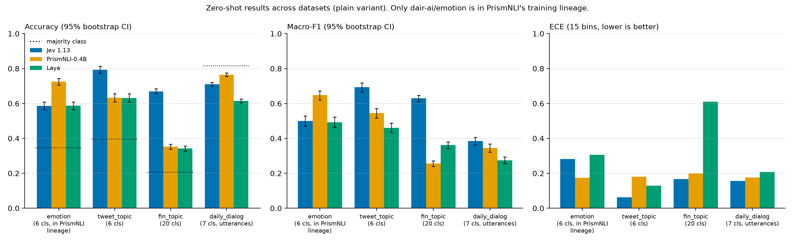

# model_decisions: zero-shot classification benchmark (Jev 1.13 vs PrismNLI-0.4B vs Laya)

Head-to-head, zero-shot evaluation of three "decision" systems. The primary run is six-way emotion
classification (`dair-ai/emotion`, test split, 2000 rows) under `PROTOCOL.md`, in two prompt
variants; a follow-up under `PROTOCOL_ADDENDUM_v2.md` adds three datasets absent from every
disclosed training list of the three systems (`tweet_topic`, `fin_topic`, `daily_dialog`: 6 / 20 / 7
classes, n = 1693 / 4117 / 7740, `plain` variant only). The systems:

| System | Kind | Where it runs |
|---|---|---|
| **Jev** (`typesafe/jev-1.13-20260917`) | remote, OpenRouter Decisions API | network |
| **Laya** (`convaiinnovations/laya`, repo root checkpoint) | local, `laya` library | Apple MPS |
| **PrismNLI-0.4B** (`Jaehun/PrismNLI-0.4B`) | local, NLI zero-shot via `transformers` | Apple MPS |

Every system gets the same raw text, the same instruction and the same label strings; nothing is
trained or tuned. On the primary dataset each is run twice: `plain` (bare label names, the headline)
and `defined` (each label carries a frozen one-line definition); the follow-up datasets have `plain`
only.

## Frozen protocol

**[`PROTOCOL.md`](PROTOCOL.md) is the binding contract.** It fixes the data revision, the exact
request bodies / prompts / hypothesis template, model revisions, retry policy, metric
definitions, latency methodology, output schema and seeds. It was frozen before any test-set
inference and may not change afterwards; any deviation must be recorded in
`results/deviations.md`. `models/common.py` holds the shared constants and dataclasses that all
modules implement against.

## Primary dataset selection

The primary run needed one dataset that is fair to all three systems at once (the follow-up datasets
are covered under "Dataset constraints" below): a proprietary
decision model reached only through an API (Jev), a binary NLI classifier that scores each label
as a hypothesis (PrismNLI), and an open non-autoregressive typed-decision model with a fixed
option-token budget (Laya). Candidates were screened before any code was written, using the
models' own documentation as the source for "in training mix" claims.

| Candidate | Why it was not chosen |
|---|---|
| **AG News** (4 topics) | Listed by the Laya authors as *in Laya's training mix*, and used as a zero-shot training/eval set by the `deberta-v3-large-zeroshot` lineage behind PrismNLI. Any lead would be uninterpretable. |
| **banking77** (77 intents) | 77 options exceed Laya's documented ~20-option `choice` budget (options share a 192-token head budget); the Laya authors themselves report a hard ceiling here. Would measure an architectural limit, not decision quality. |
| **MASSIVE intent** (60 intents) | Same option-budget problem; also part of Laya's published evaluation suite with routing tuned on it. |
| **SST-5** (5 ordinal levels) | Ordinal, so the natural Jev/Laya primitive is `score`, not `choice`; PrismNLI has no ordinal primitive, which would force an unfair mapping. |
| **BoolQ**, **XNLI**, **MNLI/ANLI** | Binary / NLI-shaped tasks: PrismNLI's home turf (and XNLI/BoolQ are in Laya's mix). A two-way task also gives weak resolution on calibration. |
| **GoEmotions** (27 labels, multi-label) | Multi-label and 27 options: violates the single-`choice` framing and Laya's option budget. |
| **TweetEval emotion** (4 labels) | Only four classes and a small test split (1,421); less resolution than the six-way task. |
| **typed-decisions** (Laya's own benchmark) | Laya's `typed-decisions` checkpoint is fine-tuned on its training split, and the general checkpoint is near chance on it by the authors' own account; it is also authored by one of the parties being compared. |
| **deepset prompt-injections** (binary, n=116) | Far too small for useful confidence intervals. |

**`dair-ai/emotion` (config `split`, official `test`, 2,000 rows, six mutually exclusive labels)
was selected because it is:**

- small enough to run cheaply (Jev cost for the whole test set was $0.03) yet large enough for
  useful bootstrap confidence intervals (+/- ~2 points on accuracy);
- six-way rather than binary, so calibration, selective classification and confusion structure
  are informative;
- naturally expressible as one typed `choice` question with the identical six label strings for
  every system, and as six NLI hypotheses with one fixed template;
- below Laya's recommended maximum number of `choice` options;
- reported by the Laya authors as *held out* from Laya's training mix, and not named anywhere in
  TypeSafe's (undisclosed) training description;
- not used for any per-model prompt tuning here (the protocol was frozen before test inference).

**What we learned after selection (see `REPORT.md` Section 5).** The contamination research done
for this report found that PrismNLI-0.4B is initialised from `deberta-v3-large-zeroshot-v2.0`
(non-`-c` variant), whose published training list includes the *train* and *validation* splits of
`dair-ai/emotion` (never the test split). That lineage was not visible on the PrismNLI model card
and was only established by tracing the initialisation checkpoint's dataset CSV and notebooks.
The dataset was kept because the protocol was already frozen and because the exposure is bounded
and documented; the report treats PrismNLI's lead as partly non-zero-shot for that reason. The
follow-up on three datasets absent from every disclosed training list is reported in
[`REPORT_FOLLOWUP.md`](REPORT_FOLLOWUP.md) (summary under "Results" below).

### Dataset constraints (follow-up datasets, `PROTOCOL_ADDENDUM_v2.md` §6)

Three follow-up datasets were chosen because they are **absent from every disclosed training list**
of the three systems ("clean" in this README and in `REPORT_FOLLOWUP.md` means exactly this, not
"verified unseen"). The evidence base is the same kind as Section 5 of `REPORT.md`: the pinned
training CSV of
`MoritzLaurer/deberta-v3-large-zeroshot-v2.0` (the checkpoint PrismNLI-0.4B is initialised from;
the non-`-c` model was trained on every row with `used_in_v1.1 == TRUE`), the PrismNLI synthetic
data seeds (WANLI only, per the dataset card and the paper), Laya's disclosed training mix (model
card table plus the `in_training` flags hard-coded in its public eval harness
`research/scripts/bench_apps.py`), and TypeSafe's statements about Jev's corpus (self-made,
undisclosed). The follow-up rows below were checked against the pinned CSV and the other sources at
the time of the addendum but, unlike the `dair-ai/emotion` row, are not recorded verbatim in
`results/contamination_research.json`. "Absent from disclosed lists" is the strongest statement
available; it is not "never seen".

| dataset (pinned) | evaluated split, n, classes | `deberta-v3-large-zeroshot-v2.0` training CSV (PrismNLI lineage) | PrismNLI synthetic seeds (WANLI) | Laya disclosed training mix / eval harness | Jev (TypeSafe) corpus | verdict |
|---|---|---|---|---|---|---|
| `dair-ai/emotion` @ `cab853a1` (**primary dataset, for contrast**) | `test`, 2000, 6 | listed as `emotion6_twitter` with **`used_in_v1.0/v1.1 = TRUE`**: train + validation splits were in the initialisation checkpoint's training pool (the card states up to 500 rows per class; not verifiable against the public notebook, whose saved output shows a 10,344-row `emotiondair` NLI pool) with a declarative emotion-hypothesis template; test split stated as held out | not a seed | card: held out | as below | **inherited exposure verified** (REPORT.md Section 5) |
| `cardiffnlp/tweet_topic_single` @ `87b7a0d1` | `test_2021`, 1693, 6 | not in the CSV. The sister set `tweet_topic_multi` is listed with `used_in_v1.0/v1.1 = FALSE`, `future_use = excluded` ("multi-label"); the single-label set does not appear at all | WANLI is MNLI-style premise/hypothesis pairs, no tweet-topic data; "tweet"/"topic" absent from the PrismNLI card and paper | not in the model-card table (AG News, BoolQ in mix; DAIR Emotion, SST-5, prompt-injections held out) and not loaded by `bench_apps.py` / `build_benchmark_nb.py`; the dev.to description names intents, NLI, safety, email triage, no tweet topics | training data "made ourselves", no corpus or benchmark named; no public-benchmark policy | absent from all disclosed lists |
| `zeroshot/twitter-financial-news-topic` @ `acbc8af2` | `validation`, 4117, 20 | listed as `twitter_financial_news_topic` with `used_in_v1.0/v1.1 = FALSE`, `future_use = excluded` ("data source and task definition too unclear"); i.e. explicitly **not** trained on (only the sibling `financial_phrasebank` sentiment set is `TRUE`) | not a seed | not in the model-card table; not loaded by the eval harness; no financial-news topic source disclosed | as above | absent from all disclosed lists; explicitly excluded by the zeroshot-v2.0 authors |
| `OpenRL/daily_dialog` @ `1668faf0` (mirror of `li2017dailydialog/daily_dialog`) | `test` flattened to utterances, 7740, 7 | listed as `daily_dialog` with `used_in_v1.0/v1.1 = FALSE`, `future_use = later`; i.e. not in the released model's training set (the emotion sets that **are** `TRUE` are `dair-ai/emotion` and `emo`/EmoContext) | not a seed | not in the model-card table; not loaded by the eval harness. Caveat: Laya's `eval/results.md` shows a trained "emotion and tone" task family (1,825 in-task questions) whose sources are not named, so a dialogue-emotion set cannot be ruled out from the disclosures | as above | absent from all disclosed lists; residual risk through Laya's unnamed emotion family |

Additional per-dataset caveats: `fin_topic` has no test split, so `validation` is used purely as an
evaluation set (never for tuning); its 20 options fall in Laya's `choice:11+` temperature bucket
(0.1006, shipped, applied as-is and recorded in `summary.json` / `env.json`), whereas the 6/7-class
sets use `choice:6-10` (1.00002). `daily_dialog` is 82% `no emotion`, so macro-F1 and per-class
results carry the information there and the majority-class accuracy is reported next to every
accuracy. `tweet_topic`'s loading script is no longer runnable under `datasets` 5, so the raw
`split_temporal/test_2021.single.json` file is read at the pinned revision via `hf_hub_download`.

### Why not an existing Jev benchmark (JevBench, jev-benchmarks, decision-model-benchmark)?

Several community benchmarks for Jev-class models appeared in the days around Jev 1.13's release.
They were reviewed and are useful context, but none fits the question asked here, which is about
*zero-shot decision quality on an independent, externally labelled dataset* where a proprietary
decision model, an open NLI classifier and an open typed-decision model can all be run natively.

| Existing suite | What it is | Why it was not used as the primary benchmark |
|---|---|---|
| [JevBench](https://github.com/fstandhartinger/jevbench) (v1.0 to v1.2.2, 19 Sep 2026) | 534 typed "decisions" across routing, answer-adequacy judging, policy checks, intent, ordinal scoring, enum extraction; composite score = Intelligence, Calibration, Speed, Cost (geometric mean). | (1) **Not independent data**: the hard-tier items were "written by Claude Opus 5 and GPT-5.6 Sol", the rest are hand-written or imported from the author's own router logs; gold labels come from the author or a deterministic grader, not from an external annotation process. (2) **Not fully public**: 109 hard-tier and 24 held-out items are private and 146 imported items are not redistributed, so a third party cannot reproduce the headline number. (3) **Built around Jev's primitives**: tasks are defined as `noul` / `choice` / `score` rubrics in TypeSafe's wire format, so the task distribution is shaped by the API being evaluated; there is no NLI adapter, and mapping `score`/`noul`/extraction items onto entailment hypotheses would require inventing a per-family conversion for PrismNLI, breaking apples-to-apples. (4) **Small and heterogeneous**: 72 public original items; per-family n is too small for the paired tests used here. (5) Its composite folds in a latency adjustment ("x2 + 0.15 s ... an assumption, not a measurement") and a cost scale; this report deliberately keeps local compute latency and remote end-to-end latency apart and reports raw quantities. (6) It was released and re-scored four times on the day before this run; it is a moving target. |
| [AbdelStark/jev-benchmarks](https://github.com/AbdelStark/jev-benchmarks) (BTZSC pilot v1, 17 Sep 2026) | Jev vs GLiNER2.5 on 100 class-balanced rows each of AG News, DAIR Emotion and Banking77, via the `btzsc/btzsc` re-packaged dataset. | Closest in spirit, and its DAIR Emotion Jev number (0.480) is the one the Laya authors cite. Not reused because: 100 rows per dataset gives a +/- 10-point CI; it repackages the data (entailment-pair format, class-balanced subsample) instead of the official 2,000-row test split; its comparator is GLiNER, not an NLI model or Laya; and its prompt (`Which single label best describes the input text?` with `label_000`-style keys and BTZSC label descriptions) differs from a bare six-way `choice`. Our Section 6(c) compares against it as context only. |
| [nibzard/decision-model-benchmark](https://github.com/nibzard/decision-model-benchmark) (18 Sep 2026) | Five suites: 77-way intent, binary spam gate, synthetic cardinality sweep, option-order stability, forced-uncertainty honesty. | Three of five suites are seeded synthetic; the 77-way suite exceeds Laya's option budget; no emotion or six-way classification suite; designed to probe API behaviours (order stability, honesty) rather than accuracy on an external dataset. |

The three suites above are complementary probes of Jev-class behaviour (order stability,
forced uncertainty, schema validity, cost composites). This repository asks a narrower question
with a stricter design: one public, versioned, externally labelled dataset, the full official test
split, one frozen prompt per variant, native probabilities from every system, paired significance
tests, and no composite score.

## Layout

```
PROTOCOL.md                 frozen protocol (read this first)
PROTOCOL_ADDENDUM_v2.md     frozen addendum: three follow-up datasets (tweet_topic, fin_topic, daily_dialog)
REPORT.md                   primary report: dair-ai/emotion (all numbers, methodology, contamination review, figures)
REPORT_FOLLOWUP.md          follow-up report: the three clean datasets vs the primary result (cross-dataset tables, pairwise tests)
benchmark.py                end-to-end driver: data -> models -> parquet -> metrics -> plots (--dataset selects the registry entry)
datasets_registry.py        DatasetSpec registry: source/revision, evaluated split, labels, instruction, hypothesis template, smoke rows
metrics.py                  PROTOCOL §5 metrics for any class count (accuracy, majority-class accuracy, macro-F1, NLL, Brier, ECE, selective, bootstrap, McNemar)
plots.py                    PROTOCOL §7 figures (PNG 200 dpi + PDF); scale to 7 and 20 classes
render_plots.py             re-render every figure from results/summary.json + parquet (no model calls)
supplementary_analysis.py   post-hoc analyses from the frozen predictions -> results/supplementary.json (no model calls)
cross_dataset_summary.py    aggregate the primary run + results/<dataset>/ -> results/cross_dataset_summary.{csv,json} and results/plots/cross_dataset_accuracy.{png,pdf}
ensemble_and_balanced.py    post-hoc: majority-vote / probability-average ensembles, any-correct oracle, balanced accuracy -> results/ensemble_and_balanced.json
supervised_baseline.py      post-hoc reference (not zero-shot): TF-IDF + logistic regression per dataset, temperature-scaled on a held-out slice -> results/supervised_baseline.json
inspect_sample.py           deterministic 22-row qualitative sample -> results/inspection_sample.{md,json} (no model calls)
jev_sequential_latency.py   Jev latency at concurrency 1 on validation rows -> results/jev_sequential_latency.json
models/common.py            LABELS, INSTRUCTION, DEFINITIONS, revisions, Prediction / LoadInfo / Backend (primary benchmark)
models/jev.py               OpenRouter Decisions API adapter (threaded, cached, retrying); takes a DatasetSpec
models/laya.py              Laya local adapter; takes a DatasetSpec, records the temperature bucket applied
models/prismnli.py          PrismNLI-0.4B zero-shot NLI adapter (+ HF pipeline equivalence check); takes a DatasetSpec
tests/                      unit tests (metrics for 6/7/20 classes, registry strings and counts, benchmark merge logic,
                            Jev adapter, plots, and a regression test against results/frozen_primary_plain/)
requirements.txt            pinned package versions
results/                    primary emotion outputs (see below); results/<dataset>/ for the follow-up datasets
```

## Setup

```bash
cd model_decisions
uv venv .venv --python 3.11
source .venv/bin/activate
uv pip install -r requirements.txt        # or: pip install -r requirements.txt
export OPENROUTER_API_KEY=...             # needed for Jev only; never printed or written to disk
```

Hardware used for the reference run: Apple M1 Max, 64 GB, `torch` MPS backend (no CUDA). The
local models run in fp32 at batch size 1; the two checkpoints (about 0.9 GB and 0.6 GB) are
downloaded once into the Hugging Face cache at their pinned revisions.

## Running

### Smoke test (validation split, first 8 rows, all models, both variants)

```bash
python benchmark.py --split validation --limit 8 --models jev,prismnli,laya --variants plain,defined
```

Smoke tests use only the first 8 rows of the **validation** split, per PROTOCOL §2, and write to
`results/smoke_validation/`. The Jev responses for validation rows are cached under
`results/cache/smoke_validation/`, never in the production cache. Per-module smoke tests also exist:

```bash
python -m models.jev --smoke          # also verifies cache resume (second pass makes 0 HTTP calls)
python -m models.prismnli --smoke     # also writes results/prismnli_pipeline_check.json
python -m models.laya --smoke
python plots.py                       # synthetic self-test of every figure
pytest -q tests/                      # unit + regression tests (frozen primary numbers must be reproduced to 1e-9)
```

### Full test run

```bash
# primary variant first (PROTOCOL §4)
python benchmark.py --split test --models jev,prismnli,laya --variants plain
# secondary variant, in a separate invocation once plain results are written and frozen
python benchmark.py --split test --models jev,prismnli,laya --variants defined
```

Runs can be split by model and by variant across invocations: `benchmark.py` merges into the
existing `results/raw_predictions.parquet`, overwriting only the columns of the models and
variants it just ran and recomputing every metric from the merged file. Jev responses are
cached in `results/cache/jev_<variant>.jsonl` keyed by `dataset_index`, so an interrupted run
resumes without re-paying for completed rows. An existing parquet from a *different* split is
moved aside (`raw_predictions.<split>.bak.parquet`) rather than merged.

Flags: `--dataset {emotion,tweet_topic,fin_topic,daily_dialog}` (default `emotion`),
`--split {eval,smoke,validation,test}` (`eval` = the dataset's evaluated split, `smoke` = its
smoke rows; `test`/`validation` are the legacy spellings accepted for `--dataset emotion` only and
rejected for every other dataset, so `validation` can never select `fin_topic`'s evaluated split),
`--smoke`, `--limit N`,
`--models jev,prismnli,laya`, `--variants plain,defined`, `--skip-plots`, `--out-dir DIR`,
`--n-bootstrap N` (protocol value 10000; lower it only for quick checks).

### Follow-up datasets (`PROTOCOL_ADDENDUM_v2.md`)

```bash
# smoke: the addendum's smoke rows only (never the evaluated split), outputs under results/<key>/smoke_<split>/
for d in tweet_topic fin_topic daily_dialog; do
  python benchmark.py --dataset $d --split smoke --limit 8 --models jev,prismnli,laya --variants plain
done
# full evaluated split, outputs under results/<key>/ (Jev cache results/<key>/cache/jev_plain.jsonl)
python benchmark.py --dataset tweet_topic --split eval --models jev,prismnli,laya --variants plain
python benchmark.py --dataset fin_topic   --split eval --models jev,prismnli,laya --variants plain
python benchmark.py --dataset daily_dialog --split eval --models jev,prismnli,laya --variants plain
```

Only `plain` exists for these datasets (no definitions were written; `--variants defined` is
rejected). Each dataset's labels, instruction, hypothesis template, pinned revision and smoke rows
live in `datasets_registry.py`; `env.json` and `summary.json` record the full spec. The `emotion`
entry reproduces the primary run byte-for-byte (same prompts, same `results/` layout). Smoke runs of
any dataset, including `emotion`, are written to a `smoke_<split>/` sub-directory
(`results/smoke_validation/`) so the frozen evaluation files are never overwritten.

### Post-run analyses (no model calls except where noted)

```bash
python supplementary_analysis.py                              # -> results/supplementary.json
python inspect_sample.py                                      # -> results/inspection_sample.{md,json} (from frozen_primary_plain/)
python render_plots.py                                        # re-render results/plots/ and results/plots/defined/
python cross_dataset_summary.py                               # -> results/cross_dataset_summary.{csv,json}, results/plots/cross_dataset_accuracy.{png,pdf}
python ensemble_and_balanced.py                               # -> results/ensemble_and_balanced.json
python supervised_baseline.py                                 # trains on each dataset's own training split; -> results/supervised_baseline.json
OPENROUTER_API_KEY=... python jev_sequential_latency.py --n 100   # Jev only; validation rows; -> results/jev_sequential_latency.json
shasum -a 256 -c results/frozen_primary_plain/SHA256SUMS      # verify the frozen primary snapshot
```

## Output files (`results/`)

| File | Contents |
|---|---|
| `raw_predictions.parquet` | one row per `(dataset_index, variant)`: text, gold, and per model `pred, p_<label>` per class (6 for emotion; 6 / 20 / 7 for the follow-up datasets), `confidence, latency_ms, error, retries` plus Jev cost/tokens/response id/model/api confidence/raw probs, Laya api confidence/act probability, PrismNLI independent-entailment probs (PROTOCOL §7) |
| `summary.json` | per variant: every §5 metric per model (with reliability tables and risk-coverage curves), pairwise exact McNemar and paired bootstrap for every model pair, latency stats, Jev cost and tokens, error and retry counts |
| `summary.csv` | one headline row per model x variant |
| `env.json` | package versions, model and dataset revisions, hardware, device/dtype, seeds, per-model `LoadInfo`, peak memory, load time, UTC timestamp |
| `plots/` (`plain`) and `plots/defined/` | accuracy/macro-F1 with CIs, per-class F1, confusion matrices, reliability diagrams, risk-coverage curves, confidence histograms, latency box plots (PNG + PDF) |
| `prismnli_pipeline_check.json` | equivalence of the PrismNLI backend with the HF zero-shot pipeline (PROTOCOL §3.3) |
| `frozen_primary_plain/` | checksummed snapshot of the primary `plain` run taken before the `defined` run: `summary.json`, `summary.csv`, `raw_predictions.parquet`, `env.json` plus `SHA256SUMS` (verify with `shasum -a 256 -c results/frozen_primary_plain/SHA256SUMS` from the repo root). All supplementary and qualitative analyses read from this snapshot |
| `supplementary.json` | output of `supplementary_analysis.py`: paired plain-vs-defined tests, top confusions, agreement/oracle, NLL epsilon sensitivity, confidence slices, errors at coverage, API-confidence comparison, length effect, paired bootstrap CIs for Brier/ECE/coverage differences, accuracy on the first 600/400 rows |
| `jev_sequential_latency.json` | output of `jev_sequential_latency.py`: Jev end-to-end latency at concurrency 1 (100 validation rows) |
| `inspection_sample.md` / `inspection_sample.json` | output of `inspect_sample.py`: 22 frozen test rows in nine categories with every model's prediction and probabilities |
| `error_analysis.md` | qualitative error analysis written from the inspection sample and the confusion patterns |
| `contamination_research.json` | verbatim, re-fetched quotes from model cards, training notebooks and press for each system's exposure to `dair-ai/emotion` (REPORT.md Section 5) |
| `run_plain.log` / `run_defined.log` | console logs of the two test-split invocations |
| `cache/` | Jev response caches (test split: `jev_plain.jsonl`, `jev_defined.jsonl`) and `cache/smoke_validation/`, `cache/seq_latency_validation/` (validation rows only) |
| `cross_dataset_summary.csv` / `cross_dataset_summary.json` | output of `cross_dataset_summary.py`: one row per dataset x model (n, classes, majority-class accuracy, accuracy and macro-F1 with CIs, Brier, ECE, NLL, mean confidence, exact-zero gold fraction, accuracy at 50%/80% coverage, p50/p95 latency with `latency_kind`, Jev cost) plus all 12 pairwise tests (exact McNemar, paired bootstrap accuracy difference), `pairwise_paired_bootstrap_extra` (paired bootstrap of macro-F1 / Brier / ECE-15 differences, same 10 000 seed-0 resamples) and `prismnli_independent_entailment` (per dataset: share of rows with two or more labels at independent P(entail) > 0.5, mean max P(entail), top predicted label and its share); the figure is `plots/cross_dataset_accuracy.{png,pdf}` |
| `ensemble_and_balanced.json` | per dataset: majority-class accuracy, per-system accuracy, majority-vote and probability-average ensemble accuracy, any-correct oracle, balanced accuracy (mean per-class recall) per system |
| `supervised_baseline.json` | TF-IDF + logistic regression trained on the dataset's own training split (emotion: train; tweet_topic: train_2020+train_2021; fin_topic: 90% of train; daily_dialog: train utterances), temperature-scaled on a held-out slice (validation / validation_2021 / 10% of train / validation utterances), evaluated on the same rows as the zero-shot systems; uncalibrated and calibrated accuracy, macro-F1, ECE-15, Brier, NLL, fitted temperature |
| `<dataset>/` (`tweet_topic/`, `fin_topic/`, `daily_dialog/`) | the same file set (`raw_predictions.parquet`, `summary.json`, `summary.csv`, `env.json`, `plots/`, `cache/`) plus `SHA256SUMS` and `run_plain.log` for each follow-up dataset of `PROTOCOL_ADDENDUM_v2.md`; `summary.*` additionally carry `n_classes` and `majority_class_accuracy`, and `env.json`/`summary.json` embed the full `DatasetSpec` (source, revision, split, labels, instruction, template) plus Laya's applied temperature bucket |
| `smoke_validation/`, `<dataset>/smoke_<split>/` | outputs of smoke runs (never the evaluated split) |

Rows on which a model failed (after all retries) carry `{model}_error`, `pred = -1` and NaN
probabilities and are counted in `n_errors`. Per PROTOCOL.md §5 all headline metrics, CIs and pairwise tests of a variant are computed on the rows every model scored (`n_common`); any shortfall is recorded under `deviation` in `summary.json` and, on the test split, appended to `results/deviations.md`.

## Reproducibility notes

- `random`, `numpy` and `torch` are seeded with 0 and `torch.use_deterministic_algorithms(True,
  warn_only=True)` is requested (PROTOCOL §8). No sampling occurs anywhere; all local inference is
  eval-mode fp32 argmax/softmax, so reruns agree to floating-point tolerance on the same device.
- Dataset and both local model revisions are pinned by commit hash; Jev is pinned to a dated model
  snapshot and the `model` string echoed by the API is recorded per response.
- Bootstrap CIs and paired bootstrap tests use `numpy.random.default_rng(0)` with 10000 resamples
  and share one index matrix.
- Remote latency (Jev) is client end-to-end and is **not comparable** to local compute latency
  (Laya, PrismNLI: batch size 1, after 10 validation warm-up calls). The `latency_kind` column and
  all figures label them separately.
- The Jev API rounds probabilities to 2 decimals and Laya to 4, so `p_gold == 0` exactly can occur;
  NLL clips at 1e-6 and `frac_gold_prob_zero` reports how often it happens.
- Full package pins are in `requirements.txt`; the exact versions used for a run are in
  `results/env.json`.

- Absolute home-directory paths in `REPORT.md`, `results/env.json`, `results/frozen_primary_plain/env.json` and the run logs were redacted to `.`/`~` before publication; `results/frozen_primary_plain/SHA256SUMS` was regenerated after that edit (the `summary.json` and `raw_predictions.parquet` digests are unchanged).

## Results

Primary variant (`plain`, bare label names), `dair-ai/emotion` test split, n = 2000, run 2026-09-20.
Full report: [`REPORT.md`](REPORT.md).

| Model | Accuracy | Macro-F1 | Brier ↓ | ECE ↓ | NLL ↓ | p50 latency | p95 latency | Cost |
|---|---|---|---|---|---|---|---|---|
| Jev 1.13 (pinned `typesafe/jev-1.13-20260917`) | 0.587 [0.565, 0.608] | 0.500 [0.471, 0.528] | 0.667 | 0.281 | 2.845 | 349 ms (remote e2e) | 593 ms (remote e2e) | $0.0284 (sum of the per-response `usage.cost` field; equals list price $0.042/M input x 676 323 tokens), 2000 calls |
| PrismNLI-0.4B | 0.725 [0.705, 0.744] | 0.647 [0.620, 0.673] | 0.441 | 0.174 | 1.174 | 58 ms (local, MPS fp32 bs=1) | 83 ms (local, MPS fp32 bs=1) | $0 API (self-hosted); *estimate*: 123 s device wall time for 2000 rows on M1 Max (about 0.034 device-hours) |
| Laya | 0.587 [0.565, 0.609] | 0.493 [0.463, 0.522] | 0.707 | 0.307 | 2.032 | 31 ms (local, MPS fp32 bs=1) | 35 ms (local, MPS fp32 bs=1) | $0 API (self-hosted); *estimate*: 63 s device wall time for 2000 rows on M1 Max (about 0.018 device-hours) |

Brackets are 95% percentile bootstrap CIs (10 000 resamples, seed 0). ECE is the 15-bin equal-width
value on max probability. Jev latency is remote end-to-end under 8 concurrent requests from Perth,
Australia; local latencies are on-device compute at batch size 1 and are not comparable to it.

### Follow-up on clean datasets (`PROTOCOL_ADDENDUM_v2.md`, `plain` only, full splits)

Three datasets absent from every disclosed training list of the three systems (constraints table
above), run 2026-09-20 with the same protocol. Full write-up: [`REPORT_FOLLOWUP.md`](REPORT_FOLLOWUP.md);
data: `results/cross_dataset_summary.{csv,json}`. `maj` = majority-class accuracy; Jev p50 is remote
end-to-end, local p50 is on-device compute (M1 Max, MPS fp32, bs = 1).

| dataset | n | classes | maj | model | accuracy [CI] | macro-F1 [CI] | Brier | ECE | NLL | p50 latency |
|---|---|---|---|---|---|---|---|---|---|---|
| emotion (in PrismNLI lineage) | 2000 | 6 | 0.348 | Jev 1.13 | 0.587 [0.565, 0.608] | 0.500 [0.471, 0.528] | 0.667 | 0.281 | 2.845 | 349 ms (remote e2e) |
| | | | | PrismNLI-0.4B | **0.725** [0.705, 0.744] | **0.647** [0.620, 0.673] | 0.441 | 0.174 | 1.174 | 58 ms (local) |
| | | | | Laya | 0.587 [0.565, 0.609] | 0.493 [0.463, 0.522] | 0.707 | 0.307 | 2.032 | 31 ms (local) |
| tweet_topic | 1693 | 6 | 0.396 | Jev 1.13 | **0.793** [0.774, 0.812] | **0.694** [0.667, 0.718] | 0.294 | 0.063 | 0.703 | 348 ms (remote e2e) |
| | | | | PrismNLI-0.4B | 0.633 [0.609, 0.655] | 0.544 [0.516, 0.571] | 0.537 | 0.181 | 1.197 | 85 ms (local) |
| | | | | Laya | 0.632 [0.609, 0.656] | 0.461 [0.434, 0.487] | 0.505 | 0.129 | 1.091 | 35 ms (local) |
| fin_topic | 4117 | 20 | 0.207 | Jev 1.13 | **0.670** [0.656, 0.684] | **0.630** [0.610, 0.647] | 0.509 | 0.166 | 1.788 | 338 ms (remote e2e) |
| | | | | PrismNLI-0.4B | 0.352 [0.338, 0.367] | 0.256 [0.240, 0.272] | 0.806 | 0.199 | 2.170 | 195 ms (local) |
| | | | | Laya | 0.342 [0.327, 0.357] | 0.362 [0.341, 0.381] | 1.249 | 0.610 | 7.841 | 44 ms (local) |
| daily_dialog | 7740 | 7 | 0.817 | Jev 1.13 | 0.710 [0.700, 0.720] | **0.385** [0.362, 0.406] | 0.460 | 0.156 | 1.451 | 330 ms (remote e2e) |
| | | | | PrismNLI-0.4B | **0.765** [0.756, 0.775] | 0.345 [0.322, 0.369] | 0.409 | 0.176 | 1.250 | 149 ms (local) |
| | | | | Laya | 0.614 [0.603, 0.625] | 0.275 [0.256, 0.294] | 0.601 | 0.208 | 1.253 | 53 ms (local) |

- "Clean" means absent from every disclosed training list, not verified unseen.
- The emotion ranking reverses on the two topic sets: Jev leads PrismNLI by +0.161 [+0.139, +0.182]
  accuracy on `tweet_topic` (McNemar p = 3.3e-48) and +0.317 [+0.300, +0.335] on `fin_topic`
  (p = 1.7e-239), with paired macro-F1 differences of +0.149 [+0.121, +0.177] and +0.374
  [+0.350, +0.396]. On `daily_dialog` the evidence is mixed: PrismNLI is significantly more accurate
  (0.765 vs 0.710, p = 1.4e-24; `no emotion` is its argmax on 80.7% of rows against an 81.7% base
  rate) and every system is below the 0.817 majority baseline; Jev's macro-F1 is higher (0.385 vs
  0.345; marginal CIs overlap slightly, paired difference +0.039 [+0.019, +0.060]).
- On emotion Jev and Laya are tied and PrismNLI is 14 points ahead; on both topic sets PrismNLI and
  Laya are tied (p = 1.000 and 0.284) and Jev is 16 to 33 points ahead.
- Jev has the lowest ECE on all three clean sets (0.063 / 0.166 / 0.156, paired differences to PrismNLI
  exclude zero) versus 0.281 on emotion; on `daily_dialog` PrismNLI has the lower Brier (0.409 vs 0.460)
  and NLL (1.250 vs 1.451).
- On `fin_topic` all three systems collapse onto a single label with this generic template: PrismNLI
  predicts `Markets` for 38.1% of rows (independent P(entail) > 0.5 for two or more labels on 83.9% of
  rows, versus 4.7% / 11.6% / 5.0% on `tweet_topic` / `daily_dialog` / emotion; from
  `prismnli_independent_entailment` in `cross_dataset_summary.json`), Laya predicts `Financials` for
  24.4% of rows, and Jev sends 146 of 160 `Financials` rows to `Earnings`. Laya's shipped `choice:11+`
  temperature (0.1006) is consistent with its near-one-hot outputs (ECE 0.610, NLL 7.841, 51.0%
  exact-zero gold probabilities); it does not affect its argmax, so its accuracy and macro-F1 are
  temperature-independent.
- The single dataset on which PrismNLI wins on both accuracy and macro-F1 is the single dataset in its
  training lineage; the emotion lead is consistent with (not proven by) inherited exposure. Task type
  is confounded with lineage in this design (PrismNLI also has the higher accuracy on the clean emotion
  set), so a task-type account is equally consistent. Hedges: three datasets, Twitter/dialogue English
  only, one frozen prompt each.



**Executive summary**

- Across the three datasets absent from every disclosed training list the emotion ranking does not
  hold: Jev is the most accurate and lowest-ECE system on `tweet_topic` (0.793 vs 0.633 / 0.632) and
  `fin_topic` (0.670 vs 0.352 / 0.342), where PrismNLI and Laya are tied; on `daily_dialog` PrismNLI is
  more accurate (0.765 vs 0.710) and Jev has the higher macro-F1 (0.385 vs 0.345 / 0.275). Task type
  (emotion vs topic) is confounded with lineage status. See "Follow-up on clean datasets" above and
  `REPORT_FOLLOWUP.md`.
- On emotion only: on `dair-ai/emotion` (the primary run, which stands as measured) PrismNLI-0.4B is
  the best system on every headline quality metric: accuracy 0.725 vs 0.587 for both Jev and Laya. The
  0.138 gap is significant (exact McNemar p = 1.5e-41; paired bootstrap 95% CI for Jev minus PrismNLI
  [-0.158, -0.118]), and it holds on every per-class F1 point estimate and at every
  selective-classification coverage level (105 vs 261 vs 292 errors at 50% coverage). This dataset is
  the one whose train and validation splits are in PrismNLI's training lineage.
- On emotion only: Jev and Laya are statistically indistinguishable in accuracy (218 vs 219 discordant rows out of
  2000; McNemar p = 1.000; paired difference CI [-0.022, +0.020]) and macro-F1 (0.500 vs 0.493) on
  emotion, so the Laya card's claimed +0.115 gap over Jev does not survive a matched protocol. The tie
  itself does not generalise: on the clean sets Laya trails Jev by 16, 33 and 10 accuracy points.
- Jev's "decision model" architecture gives no measurable advantage over the 0.4B NLI classifier on
  the emotion benchmark: it is behind on accuracy, F1, Brier (0.667 vs 0.441), ECE (0.281 vs 0.174) and
  NLL. On `tweet_topic` and `fin_topic` it is ahead on all of these (e.g. `tweet_topic` ECE 0.063 vs
  0.181, Brier 0.294 vs 0.537); on `daily_dialog` it leads on macro-F1 and ECE but PrismNLI has the
  higher accuracy (0.765 vs 0.710), lower Brier (0.409 vs 0.460) and lower NLL (1.250 vs 1.451), driven
  by the 82% `no emotion` class. Its operational properties (native choice probabilities, no weights to host, per-call price
  of $0.0142 to $0.0203 per 1000 decisions depending on prompt length) were not scored.
- On emotion only: calibration order on `plain` is PrismNLI, then Jev, then Laya (ECE 0.174 / 0.281 / 0.307). The
  Jev-over-Laya margin is small (paired bootstrap Brier -0.040 [-0.072, -0.009], ECE -0.026
  [-0.047, -0.004]) and reverses under the `defined` variant (Laya ECE 0.230 vs Jev 0.276). Jev's NLL
  is inflated by its 2-decimal API rounding (15.1% of rows put exactly 0 on the gold label). All three
  systems are over-confident in every bin that carries meaningful mass.
- On emotion only: both rankings survive the `defined` prompt variant (definitions move Jev +0.013 [+0.003, +0.023],
  PrismNLI -0.023 [-0.036, -0.010], Laya +0.011 [-0.006, +0.027]; only Laya's shift is within noise). Local per-example compute on an M1 Max (Laya p50 31 ms, PrismNLI 58 ms)
  is 6-11x below Jev's remote round trip (p50 349 ms), but these are different quantities.


### Conclusions and discussion

Everything above is measurement. This section is interpretation, written after all four datasets
were scored, and it draws on two extra post-hoc analyses that are not part of the frozen comparison:
`ensemble_and_balanced.py` (majority-vote / probability-average ensembles, any-correct oracle, balanced
accuracy) and `supervised_baseline.py` (a TF-IDF + logistic-regression model trained on each dataset's
own training split and temperature-scaled on a held-out slice, evaluated on exactly the same rows).
Outputs: `results/ensemble_and_balanced.json`, `results/supervised_baseline.json`.

**Which tasks does Jev handle well, and how much is the nature of the task?** On the evidence here,
the label set matters more than the model family. Where labels are concrete, mutually exclusive
categories (`tweet_topic`, `fin_topic`: topics of a tweet), Jev is the best zero-shot system by a wide,
statistically unambiguous margin (16 to 33 accuracy points), it is the only system whose 20-way output
stays usable, and its probabilities are the best calibrated (ECE 0.063 and 0.166). Where labels are
affective states that overlap and one of them is "none" (`daily_dialog`, `dair-ai/emotion`), no
zero-shot system is good: all three are below the majority-class baseline on `daily_dialog`, and on
`dair-ai/emotion` the NLI model wins, partly or wholly because of its inherited exposure. So the
answer is "largely the nature of the task": nominal taxonomies suit a native `choice` primitive;
fuzzy affect labels defeat every zero-shot approach and reward whichever system has seen similar
data. The design cannot fully separate task type from lineage (the two emotion sets are the two sets
where PrismNLI has the higher accuracy), so this is a supported reading, not a proof.

**What "majority" means, and are these models an ensemble?** The dotted `maj` line is the
majority-class baseline: always predict the most frequent label. It is not an ensemble. It matters
because on `daily_dialog` (81.7% `no emotion`) it beats all three zero-shot systems on accuracy, which
says that accuracy is the wrong metric there; balanced accuracy (mean per-class recall) puts Jev at
0.659 against PrismNLI 0.489 and Laya 0.423, and PrismNLI's accuracy edge comes from answering
`no emotion` on 80.7% of rows. The three systems are also not an ensemble of each other, and combining
them does not help: a majority vote (ties broken by the most confident system) scores 0.666 / 0.738 /
0.535 / 0.747 on emotion / `tweet_topic` / `fin_topic` / `daily_dialog`, and averaging the three
probability vectors 0.674 / 0.744 / 0.548 / 0.753, both below the best single system on every dataset
(0.725 / 0.793 / 0.670 / 0.765). The any-correct oracle is much higher (0.806 / 0.871 / 0.756 / 0.884),
so the systems do fail on different rows, but nothing in their confidences tells you which one to trust
on a given row.

**Pitfalls of zero-shot decision models against a well-calibrated supervised model.** A small
supervised model with post-hoc temperature scaling, trained on a few thousand labelled rows from each
dataset, is the honest comparator for anyone who has labels:

| dataset | best zero-shot (acc / macro-F1 / ECE) | TF-IDF + LR, temperature-scaled (acc / macro-F1 / ECE) | train rows |
|---|---|---|---|
| emotion | PrismNLI 0.725 / 0.647 / 0.174 | 0.860 / 0.785 / 0.031 | 16 000 |
| tweet_topic | Jev 0.793 / 0.694 / 0.063 | 0.776 / 0.555 / 0.050 | 4 374 |
| fin_topic | Jev 0.670 / 0.630 / 0.166 | 0.828 / 0.785 / 0.018 | 15 291 |
| daily_dialog | PrismNLI 0.765 / Jev 0.385 / Jev 0.156 | 0.848 / 0.367 / 0.035 | 87 170 |

- Accuracy ceiling: on three of four datasets a linear model with labels beats the best zero-shot
  system by 8 to 16 accuracy points, and its ECE after a one-parameter temperature fit is 0.02 to 0.05
  on every dataset. Zero-shot decision models are a substitute for labels, not for a trained model.
- Calibration is not portable. Jev's ECE ranges from 0.063 (`tweet_topic`) to 0.281 (emotion) with no
  way to know in advance which you will get; Laya's shipped per-option-count temperatures were fit on
  its own data and produce ECE 0.610 on a 20-label task; PrismNLI's probabilities are adapter-derived.
  A supervised model is calibrated on your validation split, so its probabilities mean something on
  your distribution. If you rely on a zero-shot system's confidence for routing, you still need a
  labelled validation set to check it, which removes part of the "no labels needed" advantage.
- Labels are prompts. The label string is the model input, and it is fragile: PrismNLI collapses to
  `Markets` because "The topic of this tweet is Markets." is entailed by almost any finance tweet; one
  line of definitions moved accuracy by 1 to 2 points in opposite directions for different systems
  (`defined` variant); Laya's own `BENCHMARKS.md` (order-stability table, English checkpoint) reports prediction flips from option order alone of 4% on DAIR Emotion (n = 200) and 15% on MASSIVE intent. None of
  this exists for a trained classifier, whose classes are indices.
- Output format artefacts. Jev returns probabilities rounded to 2 decimals, so 15% of emotion rows and
  51% of Laya's `fin_topic` rows put exactly zero on the true label; log-loss is then undefined without
  clipping, and "confidence" from the API is a different quantity from max-probability.
- Closed weights and moving versions. Jev's architecture, size and training data are undisclosed;
  the alias `typesafe/jev-1.13` resolves to a dated snapshot (`-20260917`), i.e. it is a moving
  pointer; results cannot be reproduced once the snapshot is retired, data leaves your infrastructure,
  and end-to-end latency is 330 to 350 ms per decision from this client versus sub-millisecond for a
  linear model. Contamination is unverifiable for Jev and Laya, so any public-benchmark number for
  them (including ours) carries an unknown exposure risk.
- No learning loop. When the model is wrong on your distribution there is no training signal to apply;
  the only levers are label wording and definitions, which is prompt engineering under another name.

**What these models do well.** No labelled data and no training step: a new label space is a request
body, and it can change per call. Typed, schema-constrained outputs with a probability per option
(nothing to parse, no free-text hallucination, and the distribution is at least monotone with
accuracy: Jev's accuracy among its 50% most confident decisions is 0.954 on `tweet_topic` and 0.828 on
`fin_topic`). Several questions in one call. Fast and cheap relative to a generative LLM: Jev cost
$0.014 to $0.020 per 1000 decisions here and answered in about a third of a second. Robustness to
distribution drift where a trained model degrades: on `tweet_topic`, whose test tweets are a year
later than its training tweets, zero-shot Jev (0.793) edges the supervised model (0.776) and leads it
by 14 macro-F1 points. Open-weight alternatives exist (Laya, NLI classifiers) for self-hosting at
30 to 200 ms per decision on a laptop, with the caveats above.

**Is Jev revolutionary?** Not on this evidence. It is a strong, well-packaged zero-shot classifier:
it beats a state-of-the-art 0.4B NLI model and the open Laya rebuild by 16 to 33 points on the two
clean topic sets, with the best calibration of the three and a usable 20-way output. That is a real
engineering result. It is not a capability jump: it does not beat a TF-IDF model with a few thousand
labels on three of four datasets; on affect labels it is no better than a 2020-style NLI classifier;
its calibration is dataset-dependent; and the "System One" framing describes a known idea (zero-shot
classification with typed outputs, as in the Hugging Face zero-shot pipeline, GLiNER, or
constrained-decoding classifiers) with better ergonomics, calibration-aware training (RLCD) and an
aggressive price. Two external facts fit this reading: TechCrunch reports that outside observers
suspect an open-weight LLM underneath, and JevBench's open Qwen3.5-4B rebuild lands within about one point of
Jev on its composite score (JevBench v1.2.2 README: Jev 1.13.0 75.3, SemIf on Qwen3.5-4B 74.6). The novelty is the product surface, not the model. The hedge is
the scope of this study: four English classification datasets, the `choice` primitive only, one frozen
prompt per dataset, no `noul` or `score` questions, no long structured state and no multi-question
calls, which are the settings TypeSafe markets.

**Why Laya's article showed a large win over Jev that does not reproduce.** The Laya card reports
0.595 (Laya) versus 0.480 (Jev) on DAIR Emotion. We reproduce Laya's number (0.587 on the full 2000
rows; 0.565 and 0.585 on the authors' 600- and 400-row prefixes) but measure Jev at 0.587, a tie.
The Jev figure in the article was never measured by the Laya authors: it is copied from a third-party
pilot (AbdelStark/jev-benchmarks) that scored 100 class-balanced rows with a different prompt and
label keys. Balanced sampling is the main reason for the gap: our balanced accuracy (mean per-class
recall) for Jev on this dataset is 0.497, which is what a class-balanced 100-row sample estimates, and
the article compares that against Laya's natural-distribution accuracy. On the same balanced footing
Laya scores 0.476, so the two systems are tied either way. The authors do note that "sample sizes and
prompts differ"; the headline table does not. The follow-up datasets then show that Laya's emotion
result was the high point: on `tweet_topic` and `fin_topic` it is tied with PrismNLI and 16 to 33
points behind Jev, on `daily_dialog` it is last, and on 20 labels its shipped temperature makes its
probabilities unusable. Plausible reasons, none verifiable from the disclosures: a 421M encoder
fine-tuned for two hours on the 13 task families listed in its `eval/results.md`, one of which is an undisclosed "emotion and
tone" corpus that plausibly resembles DAIR-style data; temperature buckets fit on that mix; and
latency and calibration claims in the article that compare Laya's on-GPU compute time with Jev's
network round trip, and Laya's post-fit ECE with Jev's raw ECE. Laya is not an open approximation of
Jev's abstraction so much as a narrow fine-tune whose held-out performance drops outside its training
families.

**Contamination caveat.** PrismNLI-0.4B was initialised from `deberta-v3-large-zeroshot-v2.0`, whose
card and harmonisation notebook show verified training exposure to the *train* and *validation*
splits of `dair-ai/emotion` (the card states up to 500 rows per class, which is not verifiable against
the public notebook, whose saved output shows a 10,344-row `emotiondair` NLI pool; a declarative
emotion-hypothesis template similar to ours; the test split is stated as held out). An unknown but non-zero part of PrismNLI's
14-point lead is therefore dataset familiarity rather than zero-shot capability, and the 2.3-point
drop under the `defined` template is consistent with (but not proof of) template familiarity. Laya's
authors claim the dataset was held out and Jev's authors claim all training data is self-made, but
neither publishes a training manifest, so neither claim is verifiable. PrismNLI's probabilities are
also adapter-derived (softmax over six entailment logits), so accuracy/F1 comparisons are more direct
than calibration comparisons. Details and verbatim sources: REPORT.md Section 5 and
`results/contamination_research.json`.

**Artifacts**

- [`REPORT.md`](REPORT.md) - full report (headline tables for both variants, methodology, per-class
  and confusion analysis, calibration, selective classification, contamination review, limitations).
- [`REPORT_FOLLOWUP.md`](REPORT_FOLLOWUP.md) - follow-up on the three clean datasets (cross-dataset
  headline and pairwise tables, per-dataset analysis, revisited required-analysis answers);
  [`results/cross_dataset_summary.csv`](results/cross_dataset_summary.csv) and
  [`results/plots/cross_dataset_accuracy.png`](results/plots/cross_dataset_accuracy.png).
- [`results/summary.csv`](results/summary.csv) - one headline row per model x variant
  (`results/summary.json` has every metric, reliability table and pairwise test).
- [`results/raw_predictions.parquet`](results/raw_predictions.parquet) - per-row predictions,
  probabilities, latencies and Jev cost/tokens for both variants.
- [`results/plots/`](results/plots/) - `plain` figures (PNG + PDF); `defined` counterparts in
  [`results/plots/defined/`](results/plots/defined/).
- [`results/frozen_primary_plain/`](results/frozen_primary_plain/) - checksummed snapshot of the
  primary run (`SHA256SUMS`).
