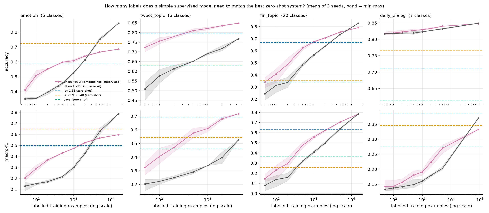
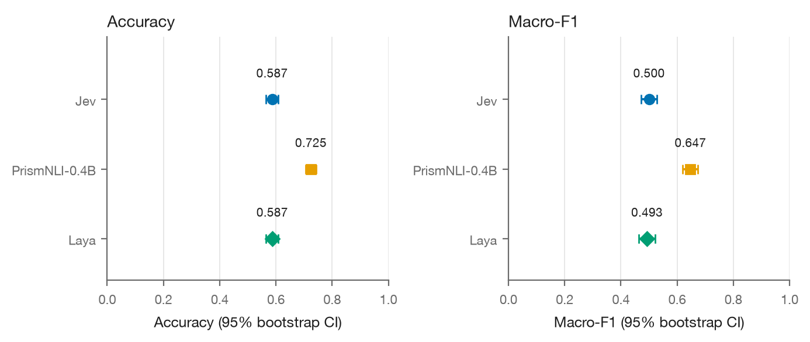
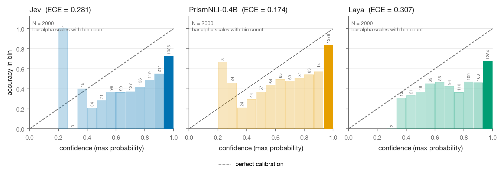
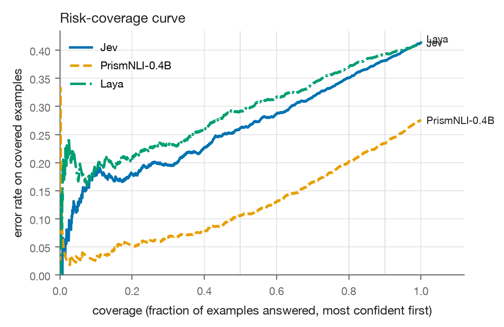
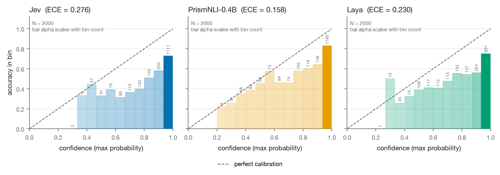
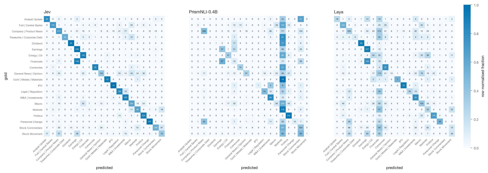
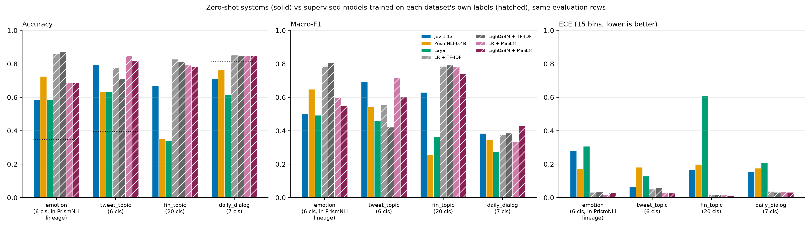

# Jev vs open decision models: a zero-shot classification benchmark

This repository measures how well three "decision" systems classify short English texts when they
are given nothing but the text and a list of label names: **Jev 1.13** (TypeSafe's proprietary
decision model, reached through OpenRouter), **PrismNLI-0.4B** (an open NLI classifier) and
**Laya** (an open typed-decision model). We ran them under one frozen protocol on four public
datasets, then added supervised reference models and a label-efficiency study to answer the
question a practitioner actually has: *is a zero-shot decision model good enough, and when does it
pay to label data instead?*

> **TL;DR**
> - **Task type beats model family.** On the two topic datasets Jev is the best zero-shot system by a
>   wide margin (accuracy 0.793 vs 0.633 / 0.632 on `tweet_topic`, 0.670 vs 0.352 / 0.342 on
>   `fin_topic`). On the two emotion datasets nobody is good: all three are below the 0.817
>   majority-class baseline on `daily_dialog`, and PrismNLI's 0.725-vs-0.587 lead on `dair-ai/emotion`
>   comes on the one dataset whose train/validation splits are in its training lineage.
> - **Laya's advertised win over Jev does not reproduce.** On `dair-ai/emotion` the two tie exactly
>   (0.587 vs 0.587, McNemar p = 1.000); on the three other datasets Laya trails Jev by 10 to 33 points.
> - **With labels, a plain linear model wins on accuracy.** Trained on each dataset's own labels (not
>   zero-shot), logistic regression beats the best zero-shot system on every dataset (accuracy 0.860 /
>   0.848 / 0.828 / 0.852 vs 0.725 / 0.793 / 0.670 / 0.765), with ECE 0.018 to 0.038 for those four
>   winning models after a one-parameter temperature fit (0.012 to 0.061 across all supervised
>   configurations; the zero-shot ECEs quoted in this README are raw, without any such fit). LightGBM
>   with fixed settings was within 2 points of logistic regression on three datasets and 3 to 7 points
>   worse on `tweet_topic`.
> - **The break-even point is a few hundred to a few thousand labels**: 500 on `tweet_topic`, 1000 on
>   `fin_topic`, about 5000 on `emotion`. On `daily_dialog` no logistic-regression model in the E6
>   learning curve reaches Jev's macro-F1 (0.385; best 0.370 at 87 170 labels). LightGBM + MiniLM does
>   on all rows (0.432), but on the 5702 rows not duplicated from the training split every supervised
>   model (0.276 to 0.308) is below Jev (0.358).
> - **You still need a labelled validation set.** With one fixed prompt Jev's accuracy ranged from
>   0.587 to 0.793 and its ECE from 0.063 to 0.281 across datasets; Laya's ECE was 0.129 to 0.307 on
>   the three 6- or 7-option datasets and 0.610 with 20 options. Nothing in the models tells you in
>   advance which you will get.


*Accuracy, macro-F1 and ECE of the three zero-shot systems on the four datasets (dotted line: majority-class accuracy). Jev wins the topic tasks; nobody wins the emotion tasks.*

The systems under test:

| System | Kind | Where it runs |
|---|---|---|
| **Jev** (`typesafe/jev-1.13-20260917`) | remote, OpenRouter Decisions API | network |
| **Laya** (`convaiinnovations/laya`, repo root checkpoint) | local, `laya` library | Apple MPS |
| **PrismNLI-0.4B** (`Jaehun/PrismNLI-0.4B`) | local, NLI zero-shot via `transformers` | Apple MPS |

Every system gets the same raw text, the same instruction and the same label strings; nothing is
trained or tuned. The supervised models in E5 and E6 are **not zero-shot: they are trained on the
dataset's own labels** and are there as a reference for anyone who has labels.

## Experiments at a glance

| Experiment | Question it tries to answer | Setup (one line) | Key result (numbers) | Conclusion (one line) | Details / links |
|---|---|---|---|---|---|
| **E1** Primary zero-shot benchmark | Which of the three systems classifies emotion best, zero-shot, under a fair frozen protocol? | `dair-ai/emotion` test split, 2000 rows, 6 labels, bare label names (`plain`), 3 systems, protocol frozen before inference | PrismNLI 0.725, Jev 0.587, Laya 0.587 accuracy; PrismNLI ECE 0.174 vs 0.281 / 0.307; Jev = Laya (McNemar p = 1.000) | PrismNLI leads by 14 points, Jev and Laya tie; the lead is confounded by PrismNLI's training lineage | `benchmark.py`; `results/summary.{json,csv}`; [REPORT.md](REPORT.md) §2, §4 |
| **E2** Prompt-robustness variant | Do the rankings survive if each label carries a one-line definition? | Same 2000 rows, `defined` variant, same 3 systems | Jev +0.013 [+0.003, +0.023], PrismNLI -0.023 [-0.036, -0.010], Laya +0.011 [-0.006, +0.027]; Laya ECE 0.307 -> 0.230 | Rankings hold; label wording moves accuracy 1 to 2 points in opposite directions per system | `benchmark.py --variants defined`; `results/supplementary.json` (`plain_vs_defined`); [REPORT.md](REPORT.md) §4.7 |
| **E3** Three datasets absent from disclosed training lists | Does the emotion result hold on data none of the systems is known to have seen? | `tweet_topic` (6 cls, n = 1693), `fin_topic` (20 cls, n = 4117), `daily_dialog` (7 cls, n = 7740), `plain` only, frozen addendum | Jev 0.793 / 0.670 / 0.710 vs PrismNLI 0.633 / 0.352 / 0.765 vs Laya 0.632 / 0.342 / 0.614; Jev ECE 0.063 / 0.166 / 0.156 | The emotion ranking reverses on topics: Jev leads by 16 to 33 points; on dialogue emotion PrismNLI is more accurate but Jev has the higher macro-F1 | `benchmark.py --dataset ...`; `results/cross_dataset_summary.{csv,json}`; [REPORT_FOLLOWUP.md](REPORT_FOLLOWUP.md) §4 |
| **E4** Ensembles, oracle, balanced accuracy | Do the three systems help each other, and what does "majority" mean on skewed data? | Post-hoc on the frozen predictions: majority vote, probability average, any-correct oracle, balanced accuracy | Majority vote 0.666 / 0.738 / 0.535 / 0.747 and prob-average 0.674 / 0.744 / 0.548 / 0.753, all below the best single system (0.725 / 0.793 / 0.670 / 0.765); oracle 0.806 / 0.871 / 0.756 / 0.884; `daily_dialog` balanced accuracy Jev 0.659 vs PrismNLI 0.489 | Combining the systems does not help; on `daily_dialog` accuracy is the wrong metric and Jev is best by balanced accuracy | `ensemble_and_balanced.py`; `results/ensemble_and_balanced.json` |
| **E5** Supervised reference models (not zero-shot) | If you have labels, how does a small trained model compare? | LR and LightGBM on TF-IDF and MiniLM features, trained on each dataset's train split, temperature-scaled on a held-out slice, scored on the same rows | Best supervised vs best zero-shot accuracy: +0.145 (emotion), +0.055 (tweet_topic), +0.158 (fin_topic), +0.086 (daily_dialog), all p < 1e-5; supervised ECE 0.012 to 0.061 after a temperature fit (zero-shot ECE is raw) | A trained linear model beats every zero-shot system on every dataset in accuracy (on `daily_dialog` the win is accuracy-only, see caveat); LightGBM was within 2 accuracy points of LR on three datasets and 3 to 7 points worse on `tweet_topic`, with these fixed settings; features matter more than the learner | `supervised_models.py`; `results/supervised_models.json`; figure `results/plots/supervised_vs_zeroshot.png` |
| **E6** Label-efficiency learning curve | How many labelled examples until the supervised model catches the best zero-shot system? | LR on MiniLM or TF-IDF, n = 50 to 5000 plus the full split, 3 seeds, accuracy and macro-F1 on the same rows | Accuracy crossover: `tweet_topic` 500 (MiniLM), `fin_topic` 1000 (MiniLM), `emotion` 5000 (TF-IDF), `daily_dialog` 50 (majority class); `daily_dialog` logistic-regression macro-F1 never reaches Jev's 0.385 (0.370 at 87 170 labels; LightGBM + MiniLM in E5 reaches 0.432 on all rows but 0.304 on the non-duplicated rows vs Jev 0.358) | A few hundred to a few thousand labels is the break-even point; on the skewed `daily_dialog` set supervised macro-F1 stays below Jev on rows the model has not seen | `learning_curve.py`; `results/learning_curve.json`; figure `results/plots/learning_curve.png` |

## Plain-English takeaways

> **Terms used below (for readers who are not data scientists)**
> - **Zero-shot**: the model gets only the text and the label names, no training examples.
> - **Accuracy** vs the **majority-class baseline**: the share of rows labelled correctly, against
>   what you get by always guessing the commonest label (0.817 on `daily_dialog`, where 82% of
>   utterances carry `no emotion`).
> - **Macro-F1**: the F1 score averaged over classes, so a rare class counts as much as a common one;
>   **balanced accuracy** is the same idea for recall.
> - **Calibration / ECE (expected calibration error)**: does "90% confident" mean right 90% of the
>   time; ECE is the average gap between stated confidence and observed hit rate (0 is perfect).
> - **McNemar p-value**: the chance that two systems which disagree this much on the same rows are
>   really equally accurate; p = 1.000 means a tie.
> - **Temperature scaling / temperature fit**: one number, fitted on a held-out labelled slice, that
>   shrinks or stretches a model's probabilities without changing its predictions.
> - **TF-IDF** vs **MiniLM**: word and word-pair counts versus a small neural sentence encoder
>   (`all-MiniLM-L6-v2`) turning each text into 384 numbers; **logistic regression (LR)** and
>   **LightGBM** are the two classical classifiers trained on those features.
> - **NLI**: natural-language inference; PrismNLI classifies by asking whether "The topic of this
>   tweet is Markets." follows from the text, one label at a time.
> - **Training lineage**: the datasets a model, or the checkpoint it was initialised from, was
>   trained on.

### It depends on the task more than on the model

When the labels are concrete, mutually exclusive categories (what is this tweet *about*?), Jev is
the best zero-shot system here by a wide and statistically unambiguous margin: 16 points ahead of
PrismNLI and Laya on `tweet_topic` (0.793 vs 0.633 / 0.632) and 32 to 33 points ahead on the 20-way
`fin_topic` (0.670 vs 0.352 / 0.342). It is also the only system whose 20-way output stays usable and
the one with the best-calibrated probabilities on those sets (ECE 0.063 and 0.166).

When the labels are feelings that overlap and one of them is "none", nobody is good. On
`daily_dialog` all three systems are below the 0.817 majority-class baseline in accuracy. On
`dair-ai/emotion` PrismNLI wins by 14 points, but that is the single dataset whose train and
validation splits sit in PrismNLI's training lineage, so the lead is consistent with dataset
familiarity as much as with capability. Task type and lineage are confounded in this design (the two
emotion sets are the two on which PrismNLI is more accurate), so "affect is hard for zero-shot models"
is a supported reading, not a proof.

### You still need a validation set, even if the model needs no training

A zero-shot model spares you training data. It does not spare you *evaluation* data, and here is
why, in plain terms:

- **You cannot know your accuracy without labelled examples.** With one and the same prompt shape,
  Jev scored 0.587 on emotion, 0.710 on dialogue emotion, 0.670 on finance topics and 0.793 on tweet
  topics. Nothing about the model or the API tells you which of those you are going to get on your
  data; only a labelled sample does.
- **The confidence numbers are only trustworthy after you check them.** Jev's ECE (how far the
  reported probability is from the observed hit rate) ranged from 0.063 to 0.281 across datasets.
  Laya's was 0.129 to 0.307 on the three 6- or 7-option datasets and 0.610 with 20 options,
  consistent with per-option-count temperatures fitted on its own data (no experiment here isolates
  that cause). If you route or auto-accept on "confidence > 0.9", you need to have seen
  what 0.9 means on your distribution.
- **Label wording changes the answer.** Adding one line of definition per label moved Jev by +1.3
  points, PrismNLI by -2.3 and Laya by +1.1 (E2). On `fin_topic` the bare label `Markets` made
  PrismNLI predict it on 38.1% of rows (gold share 3.0%), because "The topic of this tweet is
  Markets." is entailed by almost any finance tweet. The label string is the model input, and it is
  fragile.
- **The same few hundred rows are also what lets a supervised model match the zero-shot one.**
  In E6, 500 labelled tweets were enough for logistic regression on MiniLM embeddings to match Jev on
  `tweet_topic`, and 1000 on `fin_topic`. Once you have paid for the labels you need anyway, the
  trained model is often the better deal.

**What to do:** label 200 to 500 examples from your own data. Measure accuracy and calibration
(a reliability diagram is enough) on them. Pick your confidence threshold on that sample, not on
the vendor's number. Re-check whenever the label set, the wording or the data changes. And with the
same rows, cross-validate a linear model (or hold out half of them for scoring) and compare it with
the zero-shot accuracy on the held-out rows; scoring a model on the rows it was trained on tells you
nothing.

### The simplest supervised model usually wins once you have labels

The supervised models below are **not zero-shot: they are trained on each dataset's own training
split** (16 000 / 4374 / 15 291 / 87 170 rows) and temperature-scaled on a held-out slice, then
scored on exactly the rows the zero-shot systems scored. The summary below shows the most accurate
supervised configuration per dataset; the full four-configuration table is in E5. Values are
accuracy / macro-F1 / ECE. **Read the ECE columns with care: the supervised ECE is after a
one-parameter temperature fit on an in-distribution calibration slice, the zero-shot ECE is raw.**
No temperature-scaled zero-shot ECE was computed, so the calibration comparison is not like for like;
a labelled validation set would let a practitioner apply the same one-parameter fix to Jev.

| dataset | best zero-shot (raw ECE) | most accurate supervised model (ECE after temperature fit) |
|---|---|---|
| emotion | PrismNLI 0.725 / 0.647 / 0.174 | LightGBM + TF-IDF 0.870 / 0.806 / 0.033 (LR + TF-IDF 0.860 / 0.785 / 0.031) |
| tweet_topic | Jev 0.793 / 0.694 / 0.063 | LR + MiniLM 0.848 / 0.718 / 0.028 (LR + TF-IDF 0.776 / 0.555 / 0.050, below Jev) |
| fin_topic | Jev 0.670 / 0.630 / 0.166 | LR + TF-IDF 0.828 / 0.785 / 0.018 |
| daily_dialog (all 7740 rows) | PrismNLI 0.765 acc; Jev 0.385 F1; Jev 0.156 ECE | LR + TF-IDF 0.852 / 0.376 / 0.038 (LightGBM + MiniLM 0.848 / 0.432 / 0.031 has the best macro-F1) |
| daily_dialog, non-overlapping rows only (n = 5702) | PrismNLI 0.780 acc; Jev 0.358 F1; Jev 0.153 ECE | LR + TF-IDF 0.857 / 0.288 / 0.043 (every supervised macro-F1 is 0.276 to 0.308, below Jev) |

A linear model beats the best zero-shot system on emotion and `fin_topic` by 14 and 16 accuracy
points, and on `tweet_topic` by 5.5 points once the features are sentence embeddings (with TF-IDF
alone Jev still edged it, 0.793 vs 0.776). On `daily_dialog` the 9-point accuracy gain is mostly the
majority class plus duplicated dialogues (see the caveat below). After a one-parameter temperature fit
every supervised model has ECE between 0.012 and 0.061; the raw zero-shot ECEs are 0.063 to 0.610.

**`daily_dialog` caveat, always read the supervised numbers with it:** 2038 of the 7740 test
utterances (26.3%) occur verbatim in the training split, because whole dialogues are duplicated
across splits. The supervised accuracy there (0.852) is barely above the majority class (0.817;
0.830 on the non-overlapping rows), and on the 5702 rows whose text is not in the training set the
supervised macro-F1 is 0.276 to 0.308 against Jev's 0.358. For finding the rare emotions in that
dataset, zero-shot Jev is still the better tool.

### Boosted trees did not change the picture

LightGBM versus logistic regression on the same features, paired on the same rows: +1.0 points on
emotion with TF-IDF (p = 0.17) and +0.3 with MiniLM (p = 0.78); -1.6 (TF-IDF) and -0.8 (MiniLM) on
`fin_topic`; -0.5 and +0.1 on `daily_dialog`; and on `tweet_topic` trees were *worse* by 6.7 (TF-IDF)
and 3.1 (MiniLM) points. Training took 6 to 54 s instead of 0.1 to 10 s. With these fixed settings
(no hyper-parameter search was run for either learner) nothing here rewards the more complex learner,
although LightGBM has the best macro-F1 on emotion (0.806) and on `daily_dialog` (0.432 with MiniLM).

The feature representation mattered far more than the learner. Swapping TF-IDF for MiniLM sentence
embeddings (logistic regression, paired) gave +7.2 points on `tweet_topic`, -17.4 on emotion, -3.5 on
`fin_topic` and -0.4 on `daily_dialog`. Embeddings help when the training set is small (4374 tweets)
and hurt when there are enough rows for word n-grams to learn the dataset's own vocabulary.

### How many labels until supervised wins?



*Logistic regression on MiniLM or TF-IDF features, trained on n labelled rows (mean of 3 seeds, band = min to max), against the best zero-shot accuracy on the same rows.*

The accuracy crossover, i.e. the smallest training size at which the supervised mean reaches the
best zero-shot system:

| dataset | best zero-shot accuracy | crossover with MiniLM + LR | crossover with TF-IDF + LR | note |
|---|---|---|---|---|
| tweet_topic | Jev 0.793 | **500 labels** (0.810) | never (0.768 at 4374) | partial temporal shift: training tweets are from 2020 and 2021 (2858 + 1516), test tweets from 2021 |
| fin_topic | Jev 0.670 | **1000 labels** (0.675) | 5000 labels (0.734) | 20 classes; 50 labels is 2.5 per class |
| emotion | PrismNLI 0.725 | never (0.685 at 16 000) | **5000 labels** (0.751) | TF-IDF needs volume, then wins by a lot (0.860) |
| daily_dialog | PrismNLI 0.765 | 50 labels (0.818) | 50 labels (0.817) | trivially, via the 81.7% majority class; the logistic-regression macro-F1 never reaches Jev's 0.385 (best 0.370 at 87 170 labels); see E5 for LightGBM |

Rule of thumb from these four datasets: **a few hundred labels for topic-like tasks with embeddings,
a few thousand for emotion-like tasks with n-grams; on the heavily skewed `daily_dialog` set,
supervised macro-F1 stays below Jev on rows the model has not seen** (0.276 to 0.308 vs 0.358 on the
non-duplicated rows, for every E5 configuration; LightGBM + MiniLM reaches 0.432 only on all rows,
26.3% of which occur verbatim in the training split). On `tweet_topic` note the partial temporal
shift: the supervised model is trained on 2020 and 2021 tweets (2858 + 1516) and scored on the 2021
test split; TF-IDF never catches Jev there, while embeddings do at 500.

### Jack of all trades?

Jev is a strong, well-packaged zero-shot classifier: on the two topic datasets it beats an open
0.4B NLI zero-shot classifier and the open Laya rebuild by 16 to 33 points, with the best
calibration of the three and a usable 20-way output, for $0.0142 to $0.0203 per 1000 decisions and
about a third of a second per call. Its niche is real: no labels, label sets that change per request,
possibly drift where a trained model would decay (it edges the TF-IDF model on `tweet_topic`, whose
training tweets are two thirds from 2020 and whose test tweets are from 2021), and a typed API with a
probability per option. It is not a replacement for a trained model: with a few hundred to a few
thousand labels a logistic regression is more accurate on all four datasets (and better calibrated
after a temperature fit that the zero-shot systems did not get). On affect labels Jev is less
accurate than PrismNLI on both emotion sets (-13.8 and -5.5 points) but has the higher macro-F1 and
balanced accuracy on `daily_dialog` (0.385 vs 0.345; 0.659 vs 0.489), and none of the three beats
the `daily_dialog` majority class. The scope
of this study is four English classification datasets, the `choice` primitive only and one frozen
prompt per dataset; `noul`, `score`, multi-question calls and long structured state were not tested.

### What happened to Laya's claimed win

The Laya card reports 0.595 (Laya) versus 0.480 (Jev) on DAIR Emotion. We reproduce Laya (0.587)
but measure Jev at 0.587 too. The Jev number in the card was never measured by the Laya authors; it
comes from a third-party pilot that scored 100 *class-balanced* rows. Balanced sampling estimates
balanced accuracy (mean per-class recall), which for Jev on this dataset is 0.497, and the card
compares that against Laya's natural-distribution accuracy. On the same balanced footing Laya scores
0.476. The two systems are tied either way, and on the three other datasets Laya trails Jev by 10
to 33 points.

## Experiments in detail

### E1: Primary zero-shot benchmark on `dair-ai/emotion` (`plain`)

**Question.** Under one frozen, fair protocol, which of the three systems classifies six-way emotion
best, and how well calibrated is each?

**Setup.** `dair-ai/emotion` (config `split`, official `test`, 2000 rows, labels `sadness`, `joy`,
`love`, `anger`, `fear`, `surprise`), bare label names, one instruction, one NLI hypothesis template;
all three systems on all 2000 rows; 10 000-resample paired bootstrap and exact McNemar tests.
Run 2026-09-20. Full report: [`REPORT.md`](REPORT.md).

| Model | Accuracy | Macro-F1 | Brier ↓ | ECE ↓ | NLL ↓ | p50 latency | p95 latency | Cost |
|---|---|---|---|---|---|---|---|---|
| Jev 1.13 (pinned `typesafe/jev-1.13-20260917`) | 0.587 [0.565, 0.608] | 0.500 [0.471, 0.528] | 0.667 | 0.281 | 2.845 | 349 ms (remote e2e) | 593 ms (remote e2e) | $0.0284 (sum of the per-response `usage.cost` field; equals list price $0.042/M input x 676 323 tokens), 2000 calls |
| PrismNLI-0.4B | 0.725 [0.705, 0.744] | 0.647 [0.620, 0.673] | 0.441 | 0.174 | 1.174 | 58 ms (local, MPS fp32 bs=1) | 83 ms (local, MPS fp32 bs=1) | $0 API (self-hosted); *estimate*: 123 s device wall time for 2000 rows on M1 Max (about 0.034 device-hours) |
| Laya | 0.587 [0.565, 0.609] | 0.493 [0.463, 0.522] | 0.707 | 0.307 | 2.032 | 31 ms (local, MPS fp32 bs=1) | 35 ms (local, MPS fp32 bs=1) | $0 API (self-hosted); *estimate*: 63 s device wall time for 2000 rows on M1 Max (about 0.018 device-hours) |

Brackets are 95% percentile bootstrap CIs (10 000 resamples, seed 0). ECE is the 15-bin equal-width
value on max probability. Jev latency is remote end-to-end under 8 concurrent requests from Perth,
Australia (362 ms p50 / 483 ms p95 at concurrency 1 on 100 validation rows); local latencies are
on-device compute at batch size 1 and are not comparable to it.

Pairwise (accuracy difference, paired bootstrap CI, exact McNemar):

| pair | difference | 95% CI | McNemar p | discordant rows |
|---|---|---|---|---|
| Jev - PrismNLI | -0.138 | [-0.158, -0.118] | 1.5e-41 | 85 vs 361 |
| Jev - Laya | -0.001 | [-0.022, +0.020] | 1.000 | 218 vs 219 |
| PrismNLI - Laya | +0.138 | [+0.116, +0.160] | 4.1e-35 | 396 vs 121 |





**Conclusion.** PrismNLI is the best system on every headline quality metric; the 14-point lead holds
on every per-class F1 and at every selective-classification coverage (105 vs 261 vs 292 errors at
50% coverage). Jev and Laya are statistically indistinguishable. All three are over-confident in
every bin that carries mass; Jev's NLL is inflated by its 2-decimal API rounding (15.1% of rows put
exactly 0 on the gold label; 31.2% of rows report max probability 1.00, with accuracy 0.806 in that
group).

**Caveats.** PrismNLI's initialisation checkpoint was trained on this dataset's train and validation
splits (see "Contamination research and caveat"). Gold labels come from hashtag distant supervision;
389 rows defeat all three systems. Further figures: `results/plots/per_class_f1.png`,
`results/plots/confusion_matrices.png`, `results/plots/confidence_hist.png`, `results/plots/latency.png`.

**Reproduce.**

```bash
python benchmark.py --split test --models jev,prismnli,laya --variants plain
```

### E2: Prompt-robustness variant (`defined`)

**Question.** Do the E1 rankings survive when each label carries a frozen one-line definition?

**Setup.** Same 2000 rows and systems; the `defined` variant appends the definition to each label
(and to each NLI hypothesis). Paired against `plain` row by row. Run 2026-09-20 in a separate
invocation after the `plain` results were frozen and checksummed.

| Model | Accuracy (`defined`) | Macro-F1 | Brier | ECE | NLL | change vs `plain` (accuracy, paired bootstrap) | McNemar p |
|---|---|---|---|---|---|---|---|
| Jev 1.13 | 0.599 [0.577, 0.621] | 0.519 | 0.653 | 0.276 | 2.898 | +0.013 [+0.003, +0.023] | 0.015 |
| PrismNLI-0.4B | 0.702 [0.681, 0.722] | 0.639 | 0.472 | 0.158 | 1.213 | -0.023 [-0.036, -0.010] | 6.5e-4 |
| Laya | 0.598 [0.576, 0.620] | 0.481 | 0.632 | 0.230 | 1.493 | +0.011 [-0.006, +0.027] | 0.243 |

Jev cost for the `defined` run was $0.0378 (900 323 input tokens; the definitions add about 112
tokens per call).



**Conclusion.** Both rankings hold (Jev - PrismNLI is still -0.103 [-0.122, -0.083]; Jev - Laya is
+0.002 [-0.022, +0.025], p = 0.93). Definitions help Jev a little, hurt PrismNLI a little and are
within noise for Laya, whose calibration improves the most (ECE 0.307 -> 0.230, now better than Jev's
0.276). Label wording is a real lever, of about 1 to 2 points, and its sign differs per system.

**Caveats.** One definition set, written before inference and never tuned; PrismNLI's drop is
consistent with (not proof of) familiarity with the bare template. Full `defined` figures are under
`results/plots/defined/`.

**Reproduce.**

```bash
python benchmark.py --split test --models jev,prismnli,laya --variants defined
python supplementary_analysis.py        # -> results/supplementary.json (plain_vs_defined)
```

### E3: Three datasets absent from disclosed training lists

**Question.** Does the emotion result hold on datasets that none of the three systems is known to
have trained on?

**Setup.** `PROTOCOL_ADDENDUM_v2.md`, frozen before inference: `cardiffnlp/tweet_topic_single`
(`test_2021`, 1693 rows, 6 topics), `zeroshot/twitter-financial-news-topic` (`validation`, 4117 rows,
20 topics) and `OpenRL/daily_dialog` (test utterances, 7740 rows, 7 emotions), `plain` variant only,
same metrics and tests. Run 2026-09-20. Full write-up: [`REPORT_FOLLOWUP.md`](REPORT_FOLLOWUP.md);
data: `results/cross_dataset_summary.{csv,json}`. `maj` = majority-class accuracy; Jev p50 is remote
end-to-end, local p50 is on-device compute (M1 Max, MPS fp32, bs = 1).

| dataset | n | classes | maj | model | accuracy [CI] | macro-F1 [CI] | Brier | ECE | NLL | p50 latency | Jev cost |
|---|---|---|---|---|---|---|---|---|---|---|---|
| emotion (in PrismNLI lineage) | 2000 | 6 | 0.348 | Jev 1.13 | 0.587 [0.565, 0.608] | 0.500 [0.471, 0.528] | 0.667 | 0.281 | 2.845 | 349 ms (remote e2e) | $0.0284 |
| | | | | PrismNLI-0.4B | **0.725** [0.705, 0.744] | **0.647** [0.620, 0.673] | 0.441 | 0.174 | 1.174 | 58 ms (local) | |
| | | | | Laya | 0.587 [0.565, 0.609] | 0.493 [0.463, 0.522] | 0.707 | 0.307 | 2.032 | 31 ms (local) | |
| tweet_topic | 1693 | 6 | 0.396 | Jev 1.13 | **0.793** [0.774, 0.812] | **0.694** [0.667, 0.718] | 0.294 | 0.063 | 0.703 | 348 ms (remote e2e) | $0.0264 |
| | | | | PrismNLI-0.4B | 0.633 [0.609, 0.655] | 0.544 [0.516, 0.571] | 0.537 | 0.181 | 1.197 | 85 ms (local) | |
| | | | | Laya | 0.632 [0.609, 0.656] | 0.461 [0.434, 0.487] | 0.505 | 0.129 | 1.091 | 35 ms (local) | |
| fin_topic | 4117 | 20 | 0.207 | Jev 1.13 | **0.670** [0.656, 0.684] | **0.630** [0.610, 0.647] | 0.509 | 0.166 | 1.788 | 338 ms (remote e2e) | $0.0834 |
| | | | | PrismNLI-0.4B | 0.352 [0.338, 0.367] | 0.256 [0.240, 0.272] | 0.806 | 0.199 | 2.170 | 195 ms (local) | |
| | | | | Laya | 0.342 [0.327, 0.357] | 0.362 [0.341, 0.381] | 1.249 | 0.610 | 7.841 | 44 ms (local) | |
| daily_dialog | 7740 | 7 | 0.817 | Jev 1.13 | 0.710 [0.700, 0.720] | **0.385** [0.362, 0.406] | 0.460 | 0.156 | 1.451 | 330 ms (remote e2e) | $0.1124 |
| | | | | PrismNLI-0.4B | **0.765** [0.756, 0.775] | 0.345 [0.322, 0.369] | 0.409 | 0.176 | 1.250 | 149 ms (local) | |
| | | | | Laya | 0.614 [0.603, 0.625] | 0.275 [0.256, 0.294] | 0.601 | 0.208 | 1.253 | 53 ms (local) | |

Pairwise accuracy differences on the three follow-up sets (paired bootstrap CI, exact McNemar):

| dataset | Jev - PrismNLI | Jev - Laya | PrismNLI - Laya |
|---|---|---|---|
| tweet_topic | +0.161 [+0.139, +0.182], p = 3.3e-48 | +0.161 [+0.137, +0.185], p = 1.0e-37 | +0.001 [-0.024, +0.024], p = 1.000 |
| fin_topic | +0.317 [+0.300, +0.335], p = 1.7e-239 | +0.328 [+0.311, +0.345], p = 6.1e-272 | +0.010 [-0.008, +0.029], p = 0.284 |
| daily_dialog | -0.055 [-0.066, -0.045], p = 1.4e-24 | +0.096 [+0.084, +0.107], p = 4.0e-55 | +0.151 [+0.139, +0.163], p = 2.0e-135 |




*`fin_topic` confusion matrices (rows = gold). All three systems collapse onto a single label with the generic template: PrismNLI predicts `Markets` on 38.1% of rows (gold share 3.0%), Laya predicts `Financials` on 24.4%, and Jev sends 146 of 160 `Financials` rows to `Earnings`.*

**Conclusion.**

- The emotion ranking reverses on the two topic sets: Jev leads PrismNLI by +0.161 accuracy on
  `tweet_topic` and +0.317 on `fin_topic`, with paired macro-F1 differences of +0.149 [+0.121, +0.177]
  and +0.374 [+0.350, +0.396]. PrismNLI and Laya are tied on both (p = 1.000 and 0.284).
- On `daily_dialog` the evidence is mixed: PrismNLI is more accurate (0.765 vs 0.710; `no emotion` is
  its argmax on 80.7% of rows against an 81.7% base rate), every system is below the 0.817 majority
  baseline, and Jev's macro-F1 is higher (0.385 vs 0.345; paired difference +0.039 [+0.019, +0.060]).
- Jev has the lowest ECE on all three follow-up sets (0.063 / 0.166 / 0.156; paired differences to
  PrismNLI exclude zero) versus 0.281 on emotion; on `daily_dialog` PrismNLI has the lower Brier
  (0.409 vs 0.460) and NLL (1.250 vs 1.451).
- On `fin_topic` PrismNLI has independent P(entail) > 0.5 for two or more labels on 83.9% of rows,
  versus 4.7% / 11.6% / 5.0% on `tweet_topic` / `daily_dialog` / emotion
  (`prismnli_independent_entailment` in `cross_dataset_summary.json`). Laya's shipped `choice:11+`
  temperature (0.1006) is consistent with its near-one-hot outputs (ECE 0.610, NLL 7.841, 51.0%
  exact-zero gold probabilities); it does not affect its argmax.
- The single dataset on which PrismNLI wins on both accuracy and macro-F1 is the single dataset in
  its training lineage. Task type is confounded with lineage in this design.

**Caveats.** "Clean" means absent from every disclosed training list, not verified unseen. Three
datasets, Twitter and scripted dialogue English only, one frozen prompt each, no `defined` variant.
`fin_topic` has no test split, so `validation` is used purely as an evaluation set; its 20 options
fall in Laya's `choice:11+` temperature bucket (0.1006, applied as-is and recorded in `summary.json`
/ `env.json`), whereas the 6/7-class sets use `choice:6-10` (1.00002). `daily_dialog` is 82%
`no emotion`, so macro-F1 and per-class results carry the information there. `tweet_topic`'s loading
script no longer runs under `datasets` 5, so the raw `split_temporal/test_2021.single.json` file is
read at the pinned revision via `hf_hub_download`. Per-dataset figures are under
`results/<key>/plots/`.

#### Dataset constraints (`PROTOCOL_ADDENDUM_v2.md` §6)

The three follow-up datasets were chosen because they are **absent from every disclosed training
list** of the three systems. The evidence base is the same kind as Section 5 of `REPORT.md`: the
pinned training CSV of `MoritzLaurer/deberta-v3-large-zeroshot-v2.0` (the checkpoint PrismNLI-0.4B is
initialised from; the non-`-c` model was trained on every row with `used_in_v1.1 == TRUE`), the
PrismNLI synthetic data seeds (WANLI only, per the dataset card and the paper), Laya's disclosed
training mix (model card table plus the `in_training` flags hard-coded in its public eval harness
`research/scripts/bench_apps.py`), and TypeSafe's statements about Jev's corpus (self-made,
undisclosed). The follow-up rows below were checked against the pinned CSV and the other sources at
the time of the addendum but, unlike the `dair-ai/emotion` row, are not recorded verbatim in
`results/contamination_research.json`. "Absent from disclosed lists" is the strongest statement
available; it is not "never seen".

| dataset (pinned) | evaluated split, n, classes | `deberta-v3-large-zeroshot-v2.0` training CSV (PrismNLI lineage) | PrismNLI synthetic seeds (WANLI) | Laya disclosed training mix / eval harness | Jev (TypeSafe) corpus | verdict |
|---|---|---|---|---|---|---|
| `dair-ai/emotion` @ `cab853a1` (**primary dataset, for contrast**) | `test`, 2000, 6 | listed as `emotion6_twitter` with **`used_in_v1.0/v1.1 = TRUE`**: train + validation splits were in the initialisation checkpoint's training pool (the card states up to 500 rows per class; not verifiable against the public notebook, whose saved output shows a 10,344-row `emotiondair` NLI pool) with a declarative emotion-hypothesis template; test split stated as held out | not a seed | card: held out | as below | **inherited exposure verified** (REPORT.md Section 5) |
| `cardiffnlp/tweet_topic_single` @ `87b7a0d1` | `test_2021`, 1693, 6 | not in the CSV. The sister set `tweet_topic_multi` is listed with `used_in_v1.0/v1.1 = FALSE`, `future_use = excluded` ("multi-label"); the single-label set does not appear at all | WANLI is MNLI-style premise/hypothesis pairs, no tweet-topic data; "tweet"/"topic" absent from the PrismNLI card and paper | not in the model-card table (AG News, BoolQ in mix; DAIR Emotion, SST-5, prompt-injections held out) and not loaded by `bench_apps.py` / `build_benchmark_nb.py`; the dev.to description names intents, NLI, safety, email triage, no tweet topics | training data "made ourselves", no corpus or benchmark named; no public-benchmark policy | absent from all disclosed lists |
| `zeroshot/twitter-financial-news-topic` @ `acbc8af2` | `validation`, 4117, 20 | listed as `twitter_financial_news_topic` with `used_in_v1.0/v1.1 = FALSE`, `future_use = excluded` ("data source and task definition too unclear"); i.e. explicitly **not** trained on (only the sibling `financial_phrasebank` sentiment set is `TRUE`) | not a seed | not in the model-card table; not loaded by the eval harness; no financial-news topic source disclosed | as above | absent from all disclosed lists; explicitly excluded by the zeroshot-v2.0 authors |
| `OpenRL/daily_dialog` @ `1668faf0` (mirror of `li2017dailydialog/daily_dialog`) | `test` flattened to utterances, 7740, 7 | listed as `daily_dialog` with `used_in_v1.0/v1.1 = FALSE`, `future_use = later`; i.e. not in the released model's training set (the emotion sets that **are** `TRUE` are `dair-ai/emotion` and `emo`/EmoContext) | not a seed | not in the model-card table; not loaded by the eval harness. Caveat: Laya's `eval/results.md` shows a trained "emotion and tone" task family (1,825 in-task questions) whose sources are not named, so a dialogue-emotion set cannot be ruled out from the disclosures | as above | absent from all disclosed lists; residual risk through Laya's unnamed emotion family |

**Reproduce.**

```bash
python benchmark.py --dataset tweet_topic  --split eval --models jev,prismnli,laya --variants plain
python benchmark.py --dataset fin_topic    --split eval --models jev,prismnli,laya --variants plain
python benchmark.py --dataset daily_dialog --split eval --models jev,prismnli,laya --variants plain
python cross_dataset_summary.py    # -> results/cross_dataset_summary.{csv,json}, results/plots/cross_dataset_accuracy.{png,pdf}
```

### E4: Ensembles, oracle and balanced accuracy (post-hoc)

**Question.** Do the three systems fail on different rows, and does combining them help? And on a
dataset that is 82% one class, what should "good" mean?

**Setup.** Computed from the frozen per-row predictions of E1 and E3, no model calls: majority vote
(ties broken by the most confident system), average of the three probability vectors, the
"any-correct" oracle, and balanced accuracy (mean per-class recall) per system.

| dataset | majority class | best single system | majority vote | prob. average | any-correct oracle | balanced accuracy Jev / PrismNLI / Laya |
|---|---|---|---|---|---|---|
| emotion | 0.348 | PrismNLI 0.725 | 0.666 | 0.674 | 0.806 | 0.497 / 0.664 / 0.476 |
| tweet_topic | 0.396 | Jev 0.793 | 0.738 | 0.744 | 0.871 | 0.748 / 0.659 / 0.534 |
| fin_topic | 0.207 | Jev 0.670 | 0.535 | 0.548 | 0.756 | 0.733 / 0.289 / 0.440 |
| daily_dialog | 0.817 | PrismNLI 0.765 | 0.747 | 0.753 | 0.884 | 0.659 / 0.489 / 0.423 |

**Conclusion.** Both ensembles are below the best single system on every dataset. The oracle is much
higher, so the systems do fail on different rows, but nothing in their confidences tells you which
one to trust on a given row. On `daily_dialog` the majority-class baseline beats all three systems on
accuracy, which says accuracy is the wrong metric there; balanced accuracy puts Jev first (0.659) and
explains PrismNLI's accuracy edge as answering `no emotion` on 80.7% of rows.

**Caveats.** Post-hoc, not part of the frozen comparison; the tie-break rule and the equal-weight
average were the only combinations tried.

**Reproduce.**

```bash
python ensemble_and_balanced.py    # -> results/ensemble_and_balanced.json
```

### E5: Supervised reference models (not zero-shot, trained on the dataset's own labels)

**Question.** For someone who has labels, how does a small trained classifier compare with the best
zero-shot system on the same rows, in accuracy and in calibration?

**Setup.** Four configurations per dataset: logistic regression (C = 4) and LightGBM (multiclass,
early stopping on the calibration split) on word 1-2 gram TF-IDF (<= 50 000 features) and on
`all-MiniLM-L6-v2` sentence embeddings (384-d). Training splits: emotion `train` (16 000);
`tweet_topic` `train_2020` + `train_2021` (4374); `fin_topic` 90% of `train` (15 291); `daily_dialog`
train utterances (87 170). A single temperature is fitted by minimising NLL on a held-out
calibration slice (validation / `validation_2021` / 10% of train / validation utterances), then every
model is evaluated on exactly the rows the zero-shot systems scored. Paired tests use the same
10 000-resample bootstrap and exact McNemar as E1.

Accuracy / macro-F1 / ECE after temperature scaling (the temperature does not change accuracy or
macro-F1). The zero-shot column shows raw ECE (no post-hoc calibration was applied to the zero-shot
systems, by design), so the ECE columns are not like for like:

| dataset | best zero-shot (raw ECE) | LR + TF-IDF (trained, ECE after temperature fit) | LightGBM + TF-IDF (trained, same) | LR + MiniLM (trained, same) | LightGBM + MiniLM (trained, same) |
|---|---|---|---|---|---|
| emotion | PrismNLI 0.725 / 0.647 / 0.174 | 0.860 / 0.785 / 0.031 | 0.870 / 0.806 / 0.033 | 0.686 / 0.597 / 0.019 | 0.689 / 0.551 / 0.029 |
| tweet_topic | Jev 0.793 / 0.694 / 0.063 | 0.776 / 0.555 / 0.050 | 0.709 / 0.421 / 0.061 | 0.848 / 0.718 / 0.028 | 0.817 / 0.602 / 0.028 |
| fin_topic | Jev 0.670 / 0.630 / 0.166 | 0.828 / 0.785 / 0.018 | 0.811 / 0.792 / 0.015 | 0.792 / 0.784 / 0.014 | 0.784 / 0.742 / 0.012 |
| daily_dialog (all rows; 26.3% of test texts also occur in train) | PrismNLI 0.765 / Jev 0.385 / Jev 0.156 | 0.852 / 0.376 / 0.038 | 0.846 / 0.385 / 0.032 | 0.848 / 0.332 / 0.033 | 0.848 / 0.432 / 0.031 |
| daily_dialog, non-overlapping rows (n = 5702; majority 0.830) | PrismNLI 0.780 / Jev 0.358 / Jev 0.153 | 0.857 / 0.288 / 0.043 | 0.852 / 0.276 / 0.032 | 0.857 / 0.308 / 0.027 | 0.855 / 0.304 / 0.031 |

Before temperature scaling, logistic regression on TF-IDF had ECE 0.151 / 0.091 / 0.123 / 0.032; the
one-parameter fit (temperatures 0.51 / 0.84 / 0.68 / 0.97) brings it to 0.031 / 0.050 / 0.018 /
0.038. LightGBM was already close to calibrated (0.029 / 0.043 / 0.022 / 0.022 before scaling).

Paired accuracy differences (all on the same rows):

| dataset | best supervised - best zero-shot | LightGBM - LR (TF-IDF) | LightGBM - LR (MiniLM) | LR MiniLM - LR TF-IDF |
|---|---|---|---|---|
| emotion | LightGBM+TF-IDF - PrismNLI: +0.145 [+0.124, +0.167], p = 3.2e-39 | +0.010 [-0.004, +0.023], p = 0.17 | +0.003 [-0.015, +0.021], p = 0.78 | -0.174 [-0.196, -0.153], p = 3.7e-55 |
| tweet_topic | LR+MiniLM - Jev: +0.055 [+0.033, +0.077], p = 1.1e-6 | -0.067 [-0.084, -0.049], p = 1.9e-13 | -0.031 [-0.045, -0.017], p = 1.5e-5 | +0.072 [+0.051, +0.092], p = 3.9e-12 |
| fin_topic | LR+TF-IDF - Jev: +0.158 [+0.140, +0.175], p = 7.3e-69 | -0.016 [-0.026, -0.007], p = 6.4e-4 | -0.008 [-0.020, +0.003], p = 0.18 | -0.035 [-0.048, -0.022], p = 1.4e-7 |
| daily_dialog | LR+TF-IDF - PrismNLI: +0.086 [+0.077, +0.096], p = 1.2e-70 | -0.005 [-0.010, -0.000], p = 0.041 | +0.001 [-0.004, +0.005], p = 0.84 | -0.004 [-0.010, +0.002], p = 0.22 |

Cost of training and prediction (M1 Max, CPU): logistic regression trains in 0.1 to 10 s and
predicts in under 0.001 ms per example; LightGBM trains in 6 to 54 s and predicts in 0.004 to 0.118
ms per example; MiniLM encoding adds 0.17 to 0.44 ms per example (2.8 to 16.3 s per training split).
These are local compute times and are not comparable to Jev's 330 to 349 ms remote round trip.



**Conclusion.** A trained model beats the best zero-shot system on every dataset in accuracy, by 5.5
to 15.8 points, with ECE 0.012 to 0.061 after a one-parameter fit (against raw zero-shot ECE of 0.063
to 0.610; the same fit was not applied to the zero-shot systems). With these fixed settings boosted
trees do not improve on logistic regression in accuracy (within 2 points, and 3 to 7 points worse on
`tweet_topic`), though they have the best macro-F1 on emotion and `daily_dialog`; the features matter
more (MiniLM +7.2 on `tweet_topic`, -17.4 on emotion, -3.5 on `fin_topic`, -0.4 on `daily_dialog`).

**Caveats.** These models are **not zero-shot**; they saw thousands of labelled rows from the same
distribution. On `daily_dialog`, 2038 of 7740 test utterances (26.3%) occur verbatim in the training
split; on the non-overlapping rows the supervised accuracy (0.852 to 0.857) is 2 to 3 points above
the 0.830 majority class and the supervised macro-F1 (0.276 to 0.308) is below Jev's 0.358, so the
supervised models there mostly learn to say `no emotion`. For LightGBM the calibration split also
drives early stopping, so its reported calibration is slightly optimistic. No hyper-parameter search
was done for any configuration.

**Reproduce.**

```bash
python supervised_models.py       # -> results/supervised_models.json, results/supervised/<dataset>_predictions.parquet
python make_readme_figures.py     # -> results/plots/supervised_vs_zeroshot.png
```

### E6: Label-efficiency learning curve (supervised, not zero-shot)

**Question.** How many labelled examples does a simple supervised model need before it matches the
best zero-shot system on the same evaluation rows?

**Setup.** For each dataset and n in {50, 100, 200, 500, 1000, 2000, 5000} plus the full training
split, draw n rows from the training split (seeds 0, 1, 2), fit logistic regression on MiniLM
embeddings and on TF-IDF, and score accuracy and macro-F1 on the E1/E3 evaluation rows. No
calibration step. The crossover is the smallest n at which the mean accuracy reaches the best
zero-shot accuracy.

| dataset | best zero-shot (acc / F1) | MiniLM + LR accuracy at n = 200 / 500 / 1000 / full | TF-IDF + LR accuracy at n = 200 / 500 / 1000 / full | crossover MiniLM / TF-IDF | macro-F1 at full split (MiniLM / TF-IDF) |
|---|---|---|---|---|---|
| emotion | PrismNLI 0.725 / 0.647 | 0.551 / 0.598 / 0.608 / 0.685 (16 000) | 0.396 / 0.456 / 0.527 / 0.860 (16 000) | never / 5000 | 0.597 / 0.787 |
| tweet_topic | Jev 0.793 / 0.694 | 0.779 / 0.810 / 0.821 / 0.848 (4374) | 0.613 / 0.652 / 0.691 / 0.768 (4374) | 500 / never | 0.718 / 0.526 |
| fin_topic | Jev 0.670 / 0.630 | 0.487 / 0.622 / 0.675 / 0.792 (15 291) | 0.338 / 0.484 / 0.566 / 0.829 (15 291) | 1000 / 5000 | 0.784 / 0.786 |
| daily_dialog | PrismNLI 0.765 / Jev 0.385 | 0.822 / 0.827 / 0.830 / 0.848 (87 170) | 0.819 / 0.819 / 0.823 / 0.849 (87 170) | 50 / 50 | 0.332 / 0.370 |


**Conclusion.** With sentence embeddings, 500 labelled tweets match Jev on `tweet_topic` and 1000
match it on the 20-way `fin_topic`; with TF-IDF, emotion needs about 5000. On `daily_dialog` the
accuracy crossover at 50 labels is meaningless (any model that says `no emotion` scores 0.817) and
the logistic-regression macro-F1 never reaches Jev's 0.385, peaking at 0.370 with all 87 170 labels
(LightGBM + MiniLM in E5 reaches 0.432 on all rows, but on the 5702 non-duplicated rows every
supervised configuration, 0.276 to 0.308, is below Jev's 0.358).

**Caveats.** Logistic regression only, default C, three seeds (min-max band, not a CI); training
rows are drawn from the dataset's own training split, so distribution match is assumed except for a
partial temporal shift on `tweet_topic` (training tweets from 2020 and 2021, 2858 + 1516; test tweets
from 2021). The `daily_dialog` overlap caveat of E5 applies
(`accuracy_non_overlap_mean` is also in `results/learning_curve.json`).

**Reproduce.**

```bash
python learning_curve.py          # -> results/learning_curve.json, results/plots/learning_curve.{png,pdf}
```

## Frozen protocol

**[`PROTOCOL.md`](PROTOCOL.md) is the binding contract.** It fixes the data revision, the exact
request bodies / prompts / hypothesis template, model revisions, retry policy, metric
definitions, latency methodology, output schema and seeds. It was frozen before any test-set
inference and may not change afterwards; any deviation must be recorded in
`results/deviations.md` (absent in this run: no deviations occurred, `n_errors = 0` and
`n_common = n` for every model and variant in `results/summary.csv`). `models/common.py` holds the shared constants and dataclasses that all
modules implement against. [`PROTOCOL_ADDENDUM_v2.md`](PROTOCOL_ADDENDUM_v2.md) is the frozen
addendum for the three E3 datasets. E4 to E6 are post-hoc analyses outside the frozen comparison and
never touch the frozen numbers.

## Primary dataset selection

The primary run needed one dataset that is fair to all three systems at once (the follow-up datasets
are covered under "Dataset constraints" in E3): a proprietary
decision model reached only through an API (Jev), a binary NLI classifier that scores each label
as a hypothesis (PrismNLI), and an open non-autoregressive typed-decision model with a fixed
option-token budget (Laya). Candidates were screened before any code was written, using the
models' own documentation as the source for "in training mix" claims.

| Candidate | Why it was not chosen |
|---|---|
| **AG News** (4 topics) | Listed by the Laya authors as *in Laya's training mix*, and used as a zero-shot training/eval set by the `deberta-v3-large-zeroshot` lineage behind PrismNLI. Any lead would be uninterpretable. |
| **banking77** (77 intents) | 77 options exceed Laya's documented ~20-option `choice` budget (options share a 192-token head budget); the Laya authors themselves report a hard ceiling here. Would measure an architectural limit, not decision quality. |
| **MASSIVE intent** (60 intents) | Same option-budget problem; also part of Laya's published evaluation suite with routing tuned on it. |
| **SST-5** (5 ordinal levels) | Ordinal, so the natural Jev/Laya primitive is `score`, not `choice`; PrismNLI has no ordinal primitive, which would force an unfair mapping. |
| **BoolQ**, **XNLI**, **MNLI/ANLI** | Binary / NLI-shaped tasks: PrismNLI's home turf (and XNLI/BoolQ are in Laya's mix). A two-way task also gives weak resolution on calibration. |
| **GoEmotions** (27 labels, multi-label) | Multi-label and 27 options: violates the single-`choice` framing and Laya's option budget. |
| **TweetEval emotion** (4 labels) | Only four classes and a small test split (1,421); less resolution than the six-way task. |
| **typed-decisions** (Laya's own benchmark) | Laya's `typed-decisions` checkpoint is fine-tuned on its training split, and the general checkpoint is near chance on it by the authors' own account; it is also authored by one of the parties being compared. |
| **deepset prompt-injections** (binary, n=116) | Far too small for useful confidence intervals. |

**`dair-ai/emotion` (config `split`, official `test`, 2,000 rows, six mutually exclusive labels)
was selected because it is:**

- small enough to run cheaply (Jev cost for the whole test set was $0.0284) yet large enough for
  useful bootstrap confidence intervals (+/- ~2 points on accuracy);
- six-way rather than binary, so calibration, selective classification and confusion structure
  are informative;
- naturally expressible as one typed `choice` question with the identical six label strings for
  every system, and as six NLI hypotheses with one fixed template;
- below Laya's recommended maximum number of `choice` options;
- reported by the Laya authors as *held out* from Laya's training mix, and not named anywhere in
  TypeSafe's (undisclosed) training description;
- not used for any per-model prompt tuning here (the protocol was frozen before test inference).

**What we learned after selection (see `REPORT.md` Section 5).** The contamination research done
for this report found that PrismNLI-0.4B is initialised from `deberta-v3-large-zeroshot-v2.0`
(non-`-c` variant), whose published training list includes the *train* and *validation* splits of
`dair-ai/emotion` (never the test split). That lineage was not visible on the PrismNLI model card
and was only established by tracing the initialisation checkpoint's dataset CSV and notebooks.
The dataset was kept because the protocol was already frozen and because the exposure is bounded
and documented; the report treats PrismNLI's lead as partly non-zero-shot for that reason. The
follow-up on three datasets absent from every disclosed training list is E3 above and
[`REPORT_FOLLOWUP.md`](REPORT_FOLLOWUP.md).

### Why not an existing Jev benchmark (JevBench, jev-benchmarks, decision-model-benchmark)?

Several community benchmarks for Jev-class models appeared in the days around Jev 1.13's release.
They were reviewed and are useful context, but none fits the question asked here, which is about
*zero-shot decision quality on an independent, externally labelled dataset* where a proprietary
decision model, an open NLI classifier and an open typed-decision model can all be run natively.

| Existing suite | What it is | Why it was not used as the primary benchmark |
|---|---|---|
| [JevBench](https://github.com/fstandhartinger/jevbench) (v1.0 to v1.2.2, 19 Sep 2026) | 534 typed "decisions" across routing, answer-adequacy judging, policy checks, intent, ordinal scoring, enum extraction; composite score = Intelligence, Calibration, Speed, Cost (geometric mean). | (1) **Not independent data**: the hard-tier items were "written by Claude Opus 5 and GPT-5.6 Sol", the rest are hand-written or imported from the author's own router logs; gold labels come from the author or a deterministic grader, not from an external annotation process. (2) **Not fully public**: 109 hard-tier and 24 held-out items are private and 146 imported items are not redistributed, so a third party cannot reproduce the headline number. (3) **Built around Jev's primitives**: tasks are defined as `noul` / `choice` / `score` rubrics in TypeSafe's wire format, so the task distribution is shaped by the API being evaluated; there is no NLI adapter, and mapping `score`/`noul`/extraction items onto entailment hypotheses would require inventing a per-family conversion for PrismNLI, breaking apples-to-apples. (4) **Small and heterogeneous**: 72 public original items; per-family n is too small for the paired tests used here. (5) Its composite folds in a latency adjustment ("x2 + 0.15 s ... an assumption, not a measurement") and a cost scale; this report deliberately keeps local compute latency and remote end-to-end latency apart and reports raw quantities. (6) It was released and re-scored four times on the day before this run; it is a moving target. |
| [AbdelStark/jev-benchmarks](https://github.com/AbdelStark/jev-benchmarks) (BTZSC pilot v1, 17 Sep 2026) | Jev vs GLiNER2.5 on 100 class-balanced rows each of AG News, DAIR Emotion and Banking77, via the `btzsc/btzsc` re-packaged dataset. | Closest in spirit, and its DAIR Emotion Jev number (0.480) is the one the Laya authors cite. Not reused because: 100 rows per dataset gives a +/- 10-point CI; it repackages the data (entailment-pair format, class-balanced subsample) instead of the official 2,000-row test split; its comparator is GLiNER, not an NLI model or Laya; and its prompt (`Which single label best describes the input text?` with `label_000`-style keys and BTZSC label descriptions) differs from a bare six-way `choice`. Our Section 6(c) compares against it as context only. |
| [nibzard/decision-model-benchmark](https://github.com/nibzard/decision-model-benchmark) (18 Sep 2026) | Five suites: 77-way intent, binary spam gate, synthetic cardinality sweep, option-order stability, forced-uncertainty honesty. | Three of five suites are seeded synthetic; the 77-way suite exceeds Laya's option budget; no emotion or six-way classification suite; designed to probe API behaviours (order stability, honesty) rather than accuracy on an external dataset. |

The three suites above are complementary probes of Jev-class behaviour (order stability,
forced uncertainty, schema validity, cost composites). This repository asks a narrower question
with a stricter design: one public, versioned, externally labelled dataset, the full official test
split, one frozen prompt per variant, native probabilities from every system, paired significance
tests, and no composite score.

## Contamination research and caveat

`results/contamination_research.json` holds verbatim, re-fetched quotes from model cards, training
notebooks and press for each system's exposure to `dair-ai/emotion` (REPORT.md Section 5). The
verdicts: PrismNLI-0.4B, **explicit evidence of training exposure (inherited)**; Laya, **author
claims held out (unverifiable)**; Jev, **author claims held out; corpus not public (unverifiable)**.

PrismNLI-0.4B was initialised from `deberta-v3-large-zeroshot-v2.0`, whose card and harmonisation
notebook show verified training exposure to the *train* and *validation* splits of `dair-ai/emotion`
(the card states up to 500 rows per class, which is not verifiable against the public notebook,
whose saved output shows a 10,344-row `emotiondair` NLI pool; a declarative emotion-hypothesis
template similar to ours; the test split is stated as held out). An unknown but non-zero part of
PrismNLI's 14-point lead is therefore dataset familiarity rather than zero-shot capability, and the
2.3-point drop under the `defined` template is consistent with (but not proof of) template
familiarity. Laya's authors claim the dataset was held out and Jev's authors claim all training data
is self-made, but neither publishes a training manifest, so neither claim is verifiable. PrismNLI's
probabilities are also adapter-derived (softmax over six entailment logits), so accuracy/F1
comparisons are more direct than calibration comparisons. Contamination is unverifiable for Jev and
Laya, so any public-benchmark number for them (including ours) carries an unknown exposure risk.

## Setup

```bash
cd model_decisions
uv venv .venv --python 3.11
source .venv/bin/activate
uv pip install -r requirements.txt        # or: pip install -r requirements.txt
export OPENROUTER_API_KEY=...             # needed for Jev only; never printed or written to disk
```

Hardware used for the reference run: Apple M1 Max, 64 GB, `torch` MPS backend (no CUDA). The
local models run in fp32 at batch size 1; the two checkpoints (about 0.9 GB for PrismNLI and 0.8 GB
for Laya, `weight_bytes` in `results/env.json`) are
downloaded once into the Hugging Face cache at their pinned revisions. The supervised models (E5,
E6) run on CPU; MiniLM (`sentence-transformers/all-MiniLM-L6-v2`) is downloaded on first use.

## Running

### Smoke test (validation split, first 8 rows, all models, both variants)

```bash
python benchmark.py --split validation --limit 8 --models jev,prismnli,laya --variants plain,defined
```

Smoke tests use only the first 8 rows of the **validation** split, per PROTOCOL §2, and write to
`results/smoke_validation/`. The Jev responses for validation rows are cached under
`results/cache/smoke_validation/`, never in the production cache. Per-module smoke tests also exist:

```bash
python -m models.jev --smoke          # also verifies cache resume (second pass makes 0 HTTP calls)
python -m models.prismnli --smoke     # also writes results/prismnli_pipeline_check.json
python -m models.laya --smoke
python plots.py                       # synthetic self-test of every figure
pytest -q tests/                      # unit + regression tests (frozen primary numbers must be reproduced to 1e-9)
```

### Full test run (E1, E2)

```bash
# primary variant first (PROTOCOL §4)
python benchmark.py --split test --models jev,prismnli,laya --variants plain
# secondary variant, in a separate invocation once plain results are written and frozen
python benchmark.py --split test --models jev,prismnli,laya --variants defined
```

Runs can be split by model and by variant across invocations: `benchmark.py` merges into the
existing `results/raw_predictions.parquet`, overwriting only the columns of the models and
variants it just ran and recomputing every metric from the merged file. Jev responses are
cached in `results/cache/jev_<variant>.jsonl` keyed by `dataset_index`, so an interrupted run
resumes without re-paying for completed rows. An existing parquet from a *different* split is
moved aside (`raw_predictions.<split>.bak.parquet`) rather than merged.

Flags: `--dataset {emotion,tweet_topic,fin_topic,daily_dialog}` (default `emotion`),
`--split {eval,smoke,validation,test}` (`eval` = the dataset's evaluated split, `smoke` = its
smoke rows; `test`/`validation` are the legacy spellings accepted for `--dataset emotion` only and
rejected for every other dataset, so `validation` can never select `fin_topic`'s evaluated split),
`--smoke`, `--limit N`,
`--models jev,prismnli,laya`, `--variants plain,defined`, `--skip-plots`, `--out-dir DIR`,
`--n-bootstrap N` (protocol value 10000; lower it only for quick checks).

### Follow-up datasets (E3, `PROTOCOL_ADDENDUM_v2.md`)

```bash
# smoke: the addendum's smoke rows only (never the evaluated split), outputs under results/<key>/smoke_<split>/
for d in tweet_topic fin_topic daily_dialog; do
  python benchmark.py --dataset $d --split smoke --limit 8 --models jev,prismnli,laya --variants plain
done
# full evaluated split, outputs under results/<key>/ (Jev cache results/<key>/cache/jev_plain.jsonl)
python benchmark.py --dataset tweet_topic --split eval --models jev,prismnli,laya --variants plain
python benchmark.py --dataset fin_topic   --split eval --models jev,prismnli,laya --variants plain
python benchmark.py --dataset daily_dialog --split eval --models jev,prismnli,laya --variants plain
```

Only `plain` exists for these datasets (no definitions were written; `--variants defined` is
rejected). Each dataset's labels, instruction, hypothesis template, pinned revision and smoke rows
live in `datasets_registry.py`; `env.json` and `summary.json` record the full spec. The `emotion`
entry reproduces the primary run byte-for-byte (same prompts, same `results/` layout). Smoke runs of
any dataset, including `emotion`, are written to a `smoke_<split>/` sub-directory
(`results/smoke_validation/`) so the frozen evaluation files are never overwritten.

### Post-run analyses (E4 to E6 and supporting files; no model calls except where noted)

```bash
python supplementary_analysis.py                              # -> results/supplementary.json
python inspect_sample.py                                      # -> results/inspection_sample.{md,json} (from frozen_primary_plain/)
python render_plots.py                                        # re-render results/plots/ and results/plots/defined/
python cross_dataset_summary.py                               # -> results/cross_dataset_summary.{csv,json}, results/plots/cross_dataset_accuracy.{png,pdf}
python ensemble_and_balanced.py                               # E4 -> results/ensemble_and_balanced.json
python supervised_models.py                                   # E5 (not zero-shot; trains on each dataset's own training split) -> results/supervised_models.json, results/supervised/
python learning_curve.py                                      # E6 (not zero-shot) -> results/learning_curve.json, results/plots/learning_curve.{png,pdf}
python make_readme_figures.py                                 # -> results/plots/supervised_vs_zeroshot.{png,pdf}
OPENROUTER_API_KEY=... python jev_sequential_latency.py --n 100   # Jev only; validation rows; -> results/jev_sequential_latency.json
shasum -a 256 -c results/frozen_primary_plain/SHA256SUMS      # verify the frozen primary snapshot
```

## Layout

```
PROTOCOL.md                 frozen protocol (read this first)
PROTOCOL_ADDENDUM_v2.md     frozen addendum: three follow-up datasets (tweet_topic, fin_topic, daily_dialog)
REPORT.md                   primary report: dair-ai/emotion (all numbers, methodology, contamination review, figures)
REPORT_FOLLOWUP.md          follow-up report: the three clean datasets vs the primary result (cross-dataset tables, pairwise tests)
benchmark.py                end-to-end driver: data -> models -> parquet -> metrics -> plots (--dataset selects the registry entry)
datasets_registry.py        DatasetSpec registry: source/revision, evaluated split, labels, instruction, hypothesis template, smoke rows
metrics.py                  PROTOCOL §5 metrics for any class count (accuracy, majority-class accuracy, macro-F1, NLL, Brier, ECE, selective, bootstrap, McNemar)
plots.py                    PROTOCOL §7 figures (PNG 200 dpi + PDF); scale to 7 and 20 classes
render_plots.py             re-render every figure from results/summary.json + parquet (no model calls)
supplementary_analysis.py   post-hoc analyses from the frozen predictions -> results/supplementary.json (no model calls)
cross_dataset_summary.py    aggregate the primary run + results/<dataset>/ -> results/cross_dataset_summary.{csv,json} and results/plots/cross_dataset_accuracy.{png,pdf}
ensemble_and_balanced.py    E4 post-hoc: majority-vote / probability-average ensembles, any-correct oracle, balanced accuracy -> results/ensemble_and_balanced.json
supervised_models.py        E5 reference models (not zero-shot, trained on the dataset's own labels): LR and LightGBM on TF-IDF and MiniLM, temperature-scaled -> results/supervised_models.json, results/supervised/
learning_curve.py           E6 label-efficiency curve (not zero-shot): LR on MiniLM / TF-IDF vs number of labels, 3 seeds -> results/learning_curve.json, results/plots/learning_curve.{png,pdf}
make_readme_figures.py      combined README figure: results/plots/supervised_vs_zeroshot.{png,pdf}
inspect_sample.py           deterministic 22-row qualitative sample -> results/inspection_sample.{md,json} (no model calls)
jev_sequential_latency.py   Jev latency at concurrency 1 on validation rows -> results/jev_sequential_latency.json
models/common.py            LABELS, INSTRUCTION, DEFINITIONS, revisions, Prediction / LoadInfo / Backend (primary benchmark)
models/jev.py               OpenRouter Decisions API adapter (threaded, cached, retrying); takes a DatasetSpec
models/laya.py              Laya local adapter; takes a DatasetSpec, records the temperature bucket applied
models/prismnli.py          PrismNLI-0.4B zero-shot NLI adapter (+ HF pipeline equivalence check); takes a DatasetSpec
tests/                      unit tests (metrics for 6/7/20 classes, registry strings and counts, benchmark merge logic,
                            Jev adapter, plots, and a regression test against results/frozen_primary_plain/)
requirements.txt            pinned package versions
results/                    primary emotion outputs (see below); results/<dataset>/ for the follow-up datasets
```

## Output files (`results/`)

| File | Contents |
|---|---|
| `raw_predictions.parquet` | one row per `(dataset_index, variant)`: text, gold, and per model `pred, p_<label>` per class (6 for emotion; 6 / 20 / 7 for the follow-up datasets), `confidence, latency_ms, error, retries` plus Jev cost/tokens/response id/model/api confidence/raw probs, Laya api confidence/act probability, PrismNLI independent-entailment probs (PROTOCOL §7) |
| `summary.json` | per variant: every §5 metric per model (with reliability tables and risk-coverage curves), pairwise exact McNemar and paired bootstrap for every model pair, latency stats, Jev cost and tokens, error and retry counts |
| `summary.csv` | one headline row per model x variant |
| `env.json` | package versions, model and dataset revisions, hardware, device/dtype, seeds, per-model `LoadInfo`, peak memory, load time, UTC timestamp |
| `plots/` (`plain`) and `plots/defined/` | accuracy/macro-F1 with CIs, per-class F1, confusion matrices, reliability diagrams, risk-coverage curves, confidence histograms, latency box plots (PNG + PDF); `plots/` also holds the cross-experiment figures `cross_dataset_accuracy`, `supervised_vs_zeroshot` and `learning_curve` |
| `prismnli_pipeline_check.json` | equivalence of the PrismNLI backend with the HF zero-shot pipeline (PROTOCOL §3.3) |
| `frozen_primary_plain/` | checksummed snapshot of the primary `plain` run taken before the `defined` run: `summary.json`, `summary.csv`, `raw_predictions.parquet`, `env.json` plus `SHA256SUMS` (verify with `shasum -a 256 -c results/frozen_primary_plain/SHA256SUMS` from the repo root). All supplementary and qualitative analyses read from this snapshot |
| `supplementary.json` | output of `supplementary_analysis.py`: paired plain-vs-defined tests, top confusions, agreement/oracle, NLL epsilon sensitivity, confidence slices, errors at coverage, API-confidence comparison, length effect, paired bootstrap CIs for Brier/ECE/coverage differences, accuracy on the first 600/400 rows |
| `jev_sequential_latency.json` | output of `jev_sequential_latency.py`: Jev end-to-end latency at concurrency 1 (100 validation rows) |
| `inspection_sample.md` / `inspection_sample.json` | output of `inspect_sample.py`: 22 frozen test rows in nine categories with every model's prediction and probabilities |
| `error_analysis.md` | qualitative error analysis written from the inspection sample and the confusion patterns |
| `contamination_research.json` | verbatim, re-fetched quotes from model cards, training notebooks and press for each system's exposure to `dair-ai/emotion` (REPORT.md Section 5) |
| `run_plain.log` / `run_defined.log` | console logs of the two test-split invocations |
| `cache/` | Jev response caches (test split: `jev_plain.jsonl`, `jev_defined.jsonl`) and `cache/smoke_validation/`, `cache/seq_latency_validation/` (validation rows only) |
| `cross_dataset_summary.csv` / `cross_dataset_summary.json` | output of `cross_dataset_summary.py`: one row per dataset x model (n, classes, majority-class accuracy, accuracy and macro-F1 with CIs, Brier, ECE, NLL, mean confidence, exact-zero gold fraction, accuracy at 50%/80% coverage, p50/p95 latency with `latency_kind`, Jev cost) plus all 12 pairwise tests (exact McNemar, paired bootstrap accuracy difference), `pairwise_paired_bootstrap_extra` (paired bootstrap of macro-F1 / Brier / ECE-15 differences, same 10 000 seed-0 resamples) and `prismnli_independent_entailment` (per dataset: share of rows with two or more labels at independent P(entail) > 0.5, mean max P(entail), top predicted label and its share); the figure is `plots/cross_dataset_accuracy.{png,pdf}` |
| `ensemble_and_balanced.json` | E4: per dataset, majority-class accuracy, per-system accuracy, majority-vote and probability-average ensemble accuracy, any-correct oracle, balanced accuracy (mean per-class recall) per system |
| `supervised_models.json` and `supervised/<dataset>_predictions.parquet` | E5 (not zero-shot, trained on the dataset's own labels): for each of `logreg_tfidf`, `lgbm_tfidf`, `logreg_minilm`, `lgbm_minilm` per dataset, `uncalibrated`, `temperature_scaled` and `temperature_scaled_non_overlap` metrics (accuracy, macro-F1, balanced accuracy, ECE-15, Brier, NLL), fitted temperature, `train_s`, `predict_ms_per_example` (classifier only; add `minilm_encode_ms_per_eval_example` for the MiniLM configs), paired tests (LightGBM vs LR, MiniLM vs TF-IDF, best supervised vs best zero-shot), `n_eval_text_in_train` / `frac_eval_text_in_train` and `zero_shot_non_overlap` metrics for the three zero-shot systems; the parquet holds per-row probabilities for every configuration |
| `learning_curve.json` | E6 (not zero-shot): per dataset, accuracy and macro-F1 (mean / min / max over seeds 0, 1, 2) of LR on MiniLM and TF-IDF at n = 50 to 5000 and the full split, `accuracy_non_overlap_mean`, the zero-shot reference values and `crossover_n` per feature set |
| `<dataset>/` (`tweet_topic/`, `fin_topic/`, `daily_dialog/`) | the same file set (`raw_predictions.parquet`, `summary.json`, `summary.csv`, `env.json`, `plots/`, `cache/`) plus `SHA256SUMS` and `run_plain.log` for each follow-up dataset of `PROTOCOL_ADDENDUM_v2.md`; `summary.*` additionally carry `n_classes` and `majority_class_accuracy`, and `env.json`/`summary.json` embed the full `DatasetSpec` (source, revision, split, labels, instruction, template) plus Laya's applied temperature bucket |
| `smoke_validation/`, `<dataset>/smoke_<split>/` | outputs of smoke runs (never the evaluated split) |

Rows on which a model failed (after all retries) carry `{model}_error`, `pred = -1` and NaN
probabilities and are counted in `n_errors`. Per PROTOCOL.md §5 all headline metrics, CIs and pairwise tests of a variant are computed on the rows every model scored (`n_common`); any shortfall is recorded under `deviation` in `summary.json` and, on the test split, appended to `results/deviations.md` (not present: no shortfall occurred in any run).

## Reproducibility notes

- `random`, `numpy` and `torch` are seeded with 0 and `torch.use_deterministic_algorithms(True,
  warn_only=True)` is requested (PROTOCOL §8). No sampling occurs anywhere; all local inference is
  eval-mode fp32 argmax/softmax, so reruns agree to floating-point tolerance on the same device.
- Dataset and both local model revisions are pinned by commit hash; Jev is pinned to a dated model
  snapshot and the `model` string echoed by the API is recorded per response.
- Bootstrap CIs and paired bootstrap tests use `numpy.random.default_rng(0)` with 10000 resamples
  and share one index matrix.
- Remote latency (Jev) is client end-to-end and is **not comparable** to local compute latency
  (Laya, PrismNLI: batch size 1, after 10 validation warm-up calls). The `latency_kind` column and
  all figures label them separately. Supervised training and prediction times (E5) are CPU compute
  and are likewise not comparable to remote end-to-end latency.
- The Jev API rounds probabilities to 2 decimals and Laya to 4, so `p_gold == 0` exactly can occur;
  NLL clips at 1e-6 and `frac_gold_prob_zero` reports how often it happens.
- The supervised experiments (E5, E6) use `random_state = 0` for the `fin_topic` train/calibration
  split, the classifiers and the paired bootstrap (E6 subsamples with seeds 0, 1, 2); LightGBM runs
  with `n_jobs = 8`, so its fits reproduce up to thread-order effects.
- Full package pins are in `requirements.txt`; the exact versions used for a run are in
  `results/env.json`.
- Absolute home-directory paths in `REPORT.md`, `results/env.json`, `results/frozen_primary_plain/env.json` and the run logs were redacted to `.`/`~` before publication; `results/frozen_primary_plain/SHA256SUMS` was regenerated after that edit (the `summary.json` and `raw_predictions.parquet` digests are unchanged).

## Conclusions and discussion

Everything in "Experiments in detail" is measurement. This section is interpretation, written after
all four datasets were scored, and it draws on the post-hoc analyses E4 to E6 that are not part of
the frozen comparison. Outputs: `results/ensemble_and_balanced.json`, `results/supervised_models.json`,
`results/learning_curve.json`.

**Which tasks does Jev handle well, and how much is the nature of the task?** On the evidence here,
the label set matters more than the model family. Where labels are concrete, mutually exclusive
categories (`tweet_topic`, `fin_topic`: topics of a tweet), Jev is the best zero-shot system by a wide,
statistically unambiguous margin (16 to 33 accuracy points), it is the only system whose 20-way output
stays usable, and its probabilities are the best calibrated (ECE 0.063 and 0.166). Where labels are
affective states that overlap and one of them is "none" (`daily_dialog`, `dair-ai/emotion`), no
zero-shot system is good: all three are below the majority-class baseline on `daily_dialog`, and on
`dair-ai/emotion` the NLI model wins, partly because of its inherited exposure (the size of that part
is unknown). So the answer is "largely the nature of the task": nominal taxonomies suit a native
`choice` primitive; fuzzy affect labels defeat all three zero-shot systems tested here, and on
`dair-ai/emotion` the one system with verified exposure to similar data is the one that wins. The
design cannot fully separate task type from lineage (the two emotion sets are the two sets
where PrismNLI has the higher accuracy), so this is a supported reading, not a proof.

**What "majority" means, and are these models an ensemble?** The dotted `maj` line is the
majority-class baseline: always predict the most frequent label. It is not an ensemble. It matters
because on `daily_dialog` (81.7% `no emotion`) it beats all three zero-shot systems on accuracy, which
says that accuracy is the wrong metric there; balanced accuracy (mean per-class recall) puts Jev at
0.659 against PrismNLI 0.489 and Laya 0.423, and PrismNLI's accuracy edge comes from answering
`no emotion` on 80.7% of rows. The three systems are also not an ensemble of each other, and combining
them does not help (E4): majority vote 0.666 / 0.738 / 0.535 / 0.747 and probability average 0.674 /
0.744 / 0.548 / 0.753 on emotion / `tweet_topic` / `fin_topic` / `daily_dialog`, both below the best
single system on every dataset (0.725 / 0.793 / 0.670 / 0.765). The any-correct oracle is much
higher (0.806 / 0.871 / 0.756 / 0.884), so the systems do fail on different rows, but nothing in their
confidences tells you which one to trust on a given row.

**Pitfalls of zero-shot decision models against a well-calibrated supervised model.** A small
supervised model with post-hoc temperature scaling, trained on a few thousand labelled rows from each
dataset (**not zero-shot**), is the honest comparator for anyone who has labels; the E5 table above
has the full comparison. In short:

- Accuracy ceiling: the best supervised configuration beats the best zero-shot system on all four
  datasets, by 5.5 (`tweet_topic`, needs MiniLM features) to 15.8 (`fin_topic`) accuracy points, and
  its ECE after a one-parameter temperature fit is 0.012 to 0.061 on every dataset (the zero-shot ECEs
  quoted here are raw; the same fit was not applied to them, so the calibration comparison is not like
  for like). Zero-shot decision
  models are a substitute for labels, not for a trained model. (The `daily_dialog` win is in accuracy
  only; on the non-overlapping rows the supervised macro-F1 is 0.276 to 0.308 against Jev's 0.358.)
- Calibration is not portable. Jev's ECE ranges from 0.063 (`tweet_topic`) to 0.281 (emotion) with no
  way to know in advance which you will get; Laya's shipped per-option-count temperatures were fit on
  its own data and produce ECE 0.610 on a 20-label task; PrismNLI's probabilities are adapter-derived.
  A supervised model is calibrated on your validation split, so its probabilities mean something on
  your distribution. If you rely on a zero-shot system's confidence for routing, you still need a
  labelled validation set to check it, which removes part of the "no labels needed" advantage.
- Labels are prompts. The label string is the model input, and it is fragile: PrismNLI collapses to
  `Markets` because "The topic of this tweet is Markets." is entailed by almost any finance tweet; one
  line of definitions moved accuracy by 1 to 2.3 points in opposite directions for different systems
  (`defined` variant); Laya's own `BENCHMARKS.md` (order-stability table, English checkpoint) reports
  prediction flips from option order alone of 4% on DAIR Emotion (n = 200) and 15% on MASSIVE intent.
  None of this exists for a trained classifier, whose classes are indices.
- Output format artefacts. Jev returns probabilities rounded to 2 decimals, so 15% of emotion rows and
  51% of Laya's `fin_topic` rows put exactly zero on the true label; log-loss is then undefined without
  clipping, and "confidence" from the API is a different quantity from max-probability.
- Closed weights and moving versions. Jev's architecture, size and training data are undisclosed;
  the alias `typesafe/jev-1.13` resolves to a dated snapshot (`-20260917`), i.e. it is a moving
  pointer; results cannot be reproduced once the snapshot is retired, data leaves your infrastructure,
  and end-to-end latency is 330 to 350 ms per decision from this client versus sub-millisecond local
  compute for a linear model. Contamination is unverifiable for Jev and Laya, so any public-benchmark
  number for them (including ours) carries an unknown exposure risk.
- No learning loop. When the model is wrong on your distribution there is no training signal to apply;
  the only levers are label wording and definitions, which is prompt engineering under another name.

**What these models do well.** No labelled data and no training step: a new label space is a request
body, and it can change per call. Typed, schema-constrained outputs with a probability per option
(nothing to parse, no free-text hallucination, and the distribution is at least monotone with
accuracy: Jev's accuracy among its 50% most confident decisions is 0.954 on `tweet_topic` and 0.828 on
`fin_topic`). Several questions in one call. Fast and cheap relative to a generative LLM: Jev cost
$0.0142 to $0.0203 per 1000 decisions here and answered in about a third of a second. Robustness to
distribution drift where a trained model degrades: on `tweet_topic`, whose training tweets are two
thirds from 2020 (2858 of 4374, the rest from 2021) and whose test tweets are from 2021, zero-shot
Jev (0.793) edges the TF-IDF supervised model (0.776) and
leads it by 14 macro-F1 points (though a MiniLM-based model trained on the same 4374 rows beats Jev,
0.848). Open-weight alternatives exist (Laya, NLI classifiers) for self-hosting at 30 to 200 ms per
decision on a laptop, with the caveats above.

**Is Jev revolutionary?** Not on this evidence. It is a strong, well-packaged zero-shot classifier:
it beats an open 0.4B NLI zero-shot classifier and the open Laya rebuild by 16 to 33 points on the two
clean topic sets, with the best calibration of the three and a usable 20-way output. That is a real
engineering result. It is not a capability jump: it does not beat a logistic regression with a few
hundred to a few thousand labels on any of the four datasets; on affect labels it is less accurate
than PrismNLI on both emotion sets (-13.8 and -5.5 points), though it has the higher macro-F1 and
balanced accuracy on `daily_dialog` (0.385 vs 0.345; 0.659 vs 0.489); its calibration is
dataset-dependent; and the "System One" framing
describes a known idea (zero-shot classification with typed outputs, as in the Hugging Face
zero-shot pipeline, GLiNER, or constrained-decoding classifiers) with better ergonomics,
calibration-aware training (RLCD) and an aggressive price. Two external facts fit this reading:
TechCrunch reports that outside observers suspect an open-weight LLM underneath, and JevBench's open
Qwen3.5-4B rebuild lands within about one point of Jev on its composite score (JevBench v1.2.2 README:
Jev 1.13.0 75.3, SemIf on Qwen3.5-4B 74.6). The novelty is the product surface, not the model. The
hedge is the scope of this study: four English classification datasets, the `choice` primitive only,
one frozen prompt per dataset, no `noul` or `score` questions, no long structured state and no
multi-question calls, which are the settings TypeSafe markets.

**Why Laya's article showed a large win over Jev that does not reproduce.** The Laya card reports
0.595 (Laya) versus 0.480 (Jev) on DAIR Emotion. We reproduce Laya's number (0.587 on the full 2000
rows; 0.565 and 0.585 on the authors' 600- and 400-row prefixes) but measure Jev at 0.587, a tie.
The Jev figure in the article was never measured by the Laya authors: it is copied from a third-party
pilot (AbdelStark/jev-benchmarks) that scored 100 class-balanced rows with a different prompt and
label keys. Balanced sampling is the main reason for the gap: our balanced accuracy (mean per-class
recall) for Jev on this dataset is 0.497, which is what a class-balanced 100-row sample estimates, and
the article compares that against Laya's natural-distribution accuracy. On the same balanced footing
Laya scores 0.476, so the two systems are tied either way. The authors do note that "sample sizes and
prompts differ"; the headline table does not. The follow-up datasets then show that Laya's emotion
result was the high point: on `tweet_topic` and `fin_topic` it is tied with PrismNLI and 16 to 33
points behind Jev, on `daily_dialog` it is last, and on 20 labels its shipped temperature makes its
probabilities unusable. Plausible reasons, none verifiable from the disclosures: a 421M encoder
fine-tuned for two hours on the 13 task families listed in its `eval/results.md`, one of which is an
undisclosed "emotion and tone" corpus that plausibly resembles DAIR-style data; temperature buckets
fit on that mix; and latency and calibration claims in the article that compare Laya's on-GPU compute
time with Jev's network round trip, and Laya's post-fit ECE with Jev's raw ECE. Laya is not an open
approximation of Jev's abstraction so much as a narrow fine-tune whose held-out performance drops
outside its training families.

## Limitations

Collected from `REPORT.md` §7 and `REPORT_FOLLOWUP.md` §6, plus the post-hoc experiments.

- Four English classification datasets: Twitter (2018 and 2020/2021), financial-news tweets, and
  scripted two-person dialogue. No long documents, no non-English text, no ordinal or multi-label
  tasks; only the `choice` primitive; no `noul`, `score`, multi-question or long-state calls.
- Label noise bounds every system. `dair-ai/emotion` gold labels come from hashtag distant
  supervision (389 rows defeat all three systems; the 22-row inspection sample shows many are label
  noise). `daily_dialog` is 82% `no emotion` and utterances are scored without context. `fin_topic`'s
  taxonomy has overlapping labels (`Financials` / `Earnings`, `Markets` / `Stock Commentary` /
  `Stock Movement`) and no definitions. `tweet_topic`'s `pop culture` / `arts & culture` boundary
  defeats all three systems.
- Contamination: verified inherited exposure for PrismNLI on `dair-ai/emotion` (train/validation);
  unverifiable claims for Laya and Jev; "absent from disclosed lists" for the E3 datasets cannot be
  strengthened because Jev's corpus and Laya's prior checkpoint are undisclosed. Laya's undated
  "emotion and tone" training family could overlap DailyDialog-like data.
- Task type is confounded with lineage status: the two emotion sets are the two on which PrismNLI is
  more accurate, the two topic sets are the two on which Jev wins. The design cannot separate
  "PrismNLI saw `dair-ai/emotion`" from "NLI with a declarative template is better at emotion".
- One prompt per variant, frozen before inference; no prompt search and no per-model tuning; no
  `defined` variant on the E3 datasets, so PrismNLI's `fin_topic` collapse may be template
  sensitivity rather than a capability ceiling.
- Jev returns probabilities rounded to 2 decimals (exact-zero gold probability on 15.1% of emotion
  rows and 1.8% to 7.8% of follow-up rows), which inflates NLL by construction and coarsens ECE bins;
  Laya rounds to 4 decimals and its `choice:11+` temperature produces 51.0% exact zeros on `fin_topic`.
  No post-hoc calibration was applied to the zero-shot systems by design.
- PrismNLI probabilities are adapter-derived from a binary NLI head; calibration comparisons with
  native choice models are indirect. Its 20-hypothesis cost per example on `fin_topic` would differ
  with batching.
- Local latency and memory are Apple MPS fp32 at batch size 1, not CUDA; Jev latency is from one
  client location (Perth) under concurrency 8 plus one 100-row sequential run, and includes network
  time and provider queueing. Remote end-to-end and local compute latencies are never compared as
  like quantities.
- `fin_topic` has no test split; `validation` was used purely as an evaluation set but is the split
  the dataset authors intended for model selection. The follow-up datasets were chosen after the
  primary result was known (the addendum was frozen before inference on them).
- Supervised models (E5, E6) are not zero-shot and are not part of the frozen comparison: no
  hyper-parameter search, LightGBM's calibration split also drives early stopping, three seeds in E6
  give a min-max band rather than a CI, and on `daily_dialog` 26.3% of evaluation texts occur
  verbatim in the training split (non-overlap metrics are reported alongside).
- Jev's parameter count, architecture and base corpus are undisclosed; Laya's prior checkpoint is
  undisclosed; the `typesafe/jev-1.13` alias is a moving pointer to a dated snapshot.

## Artifacts

- [`REPORT.md`](REPORT.md) - full primary report (headline tables for both variants, methodology,
  per-class and confusion analysis, calibration, selective classification, contamination review,
  limitations).
- [`REPORT_FOLLOWUP.md`](REPORT_FOLLOWUP.md) - follow-up on the three clean datasets (cross-dataset
  headline and pairwise tables, per-dataset analysis, revisited required-analysis answers);
  [`results/cross_dataset_summary.csv`](results/cross_dataset_summary.csv) and
  [`results/plots/cross_dataset_accuracy.png`](results/plots/cross_dataset_accuracy.png).
- [`results/summary.csv`](results/summary.csv) - one headline row per model x variant
  (`results/summary.json` has every metric, reliability table and pairwise test).
- [`results/raw_predictions.parquet`](results/raw_predictions.parquet) - per-row predictions,
  probabilities, latencies and Jev cost/tokens for both variants.
- [`results/plots/`](results/plots/) - `plain` figures (PNG + PDF), the cross-experiment figures,
  and `defined` counterparts in [`results/plots/defined/`](results/plots/defined/).
- [`results/frozen_primary_plain/`](results/frozen_primary_plain/) - checksummed snapshot of the
  primary run (`SHA256SUMS`).
- [`results/ensemble_and_balanced.json`](results/ensemble_and_balanced.json),
  [`results/supervised_models.json`](results/supervised_models.json),
  [`results/learning_curve.json`](results/learning_curve.json) - E4, E5, E6 outputs.

Repository: <https://github.com/elcronos/jev-vs-open-decision-models>.
